[栈和队列](#栈和队列)

[串、数组和广义表](#串、数组和广义表)

[树和二叉树](#树和二叉树)

[图](#图)

[查找](#查找)

[排序](#排序)


本文为《数据结构（C语言版）》的读书笔记。内容摘录与分析仅供学习和参考，具体细节请参阅原书。

```
书名：数据结构（C语言版）（第2版）
作者：严蔚敏 李冬梅 吴伟民
出版社：人民邮电出版社
出版时间：2015-02-01
ISBN：9787115379504
```


# 栈和队列


## 栈的定义和特点

**栈**（stack）是限定仅在表尾进行插入或删除操作的线性表。因此，对栈来说，表尾端有其特殊含义，称为**栈顶**（top），相应地，表头端称为**栈底**（bottom）。不含元素的空表称为**空栈**。

n个不同的元素进栈，则出栈元素的所有可能排列情况共有$\frac{1}{n+1}C_{2n}^{n}$种。

栈的修改是遵循后进先出的原则，因此又称为后进先出的线性表（简称LIFO结构）。


## 栈的表示和操作的实现


### 顺序栈的表示和实现

栈的顺序实现遵循如下原则：

- 利用一组地址连续的存储单元以此存放自栈底到栈顶的元素
- 设指针`top`指示栈顶元素在栈中的位置，以`top == 0`表示空栈
- 一般地，在初始化栈时不应假设栈的最大容量
- 先为栈分配一个基本容量，当栈的空间不够使用时再逐渐扩大
- 设常量`STACK_INIT_SIZE`表示存储空间初始分配量，常量`STACK_INCREMENT`表示存储分配增量


```c++
#define STACK_INIT_SIZE 100   // 栈初始容量
#define STACK_INCREMENT 10    // 栈容量扩展的增量
typedef int SElemType;        // 栈元素的数据类型

// 定义顺序栈结构体
typedef struct {
    SElemType *base;  // 栈底指针
    SElemType *top;   // 栈顶指针
    int stacksize;    // 栈的当前容量
} SqStack;
```

顺序栈基础操作的实现：

```c++
// 初始化栈
void InitStack(SqStack *S) {
    S->base = (SElemType *)malloc(STACK_INIT_SIZE * sizeof(SElemType)); // 分配初始空间
    if (!S->base) exit(0);  // 若分配失败，退出
    S->top = S->base;       // 栈顶指向栈底，表示空栈
    S->stacksize = STACK_INIT_SIZE;
}

// 获取栈顶元素
int GetTop(SqStack S, SElemType *e) {
    if (S.top == S.base) return 0;  // 栈空，返回失败
    *e = *(S.top - 1);              // 获取栈顶元素
    return 1;                       // 返回成功
}

// 压栈操作
void Push(SqStack *S, SElemType e) {
    // 判断是否需要扩展栈的空间
    if (S->top - S->base >= S->stacksize) {
        S->base = (SElemType *)realloc(S->base, (S->stacksize + STACK_INCREMENT) * sizeof(SElemType));
        if (!S->base) exit(0);  // 若分配失败，退出
        S->top = S->base + S->stacksize;
        S->stacksize += STACK_INCREMENT;
    }
    *(S->top) = e;   // 将元素压入栈顶
    S->top++;        // 栈顶指针上移
}

// 弹栈操作
int Pop(SqStack *S, SElemType *e) {
    if (S->top == S->base) return 0;  // 栈空，返回失败
    S->top--;                         // 栈顶指针下移
    *e = *(S->top);                   // 将栈顶元素赋值给e
    return 1;                         // 返回成功
}

// 销毁栈
void DestroyStack(SqStack *S) {
    free(S->base);   // 释放栈空间
    S->base = NULL;  // 置空指针
    S->top = NULL;
    S->stacksize = 0;
}

// 判断栈是否为空
int StackEmpty(SqStack S) {
    return S.top == S.base;
}
```


### 链栈的表示和实现

链栈是指采用链式存储结构实现的栈，通常链栈用单链表来表示，链栈的结点结构与单链表的结构相同，在此用StackNode表示，定义如下：

```c++
typedef int SElemType;  // 栈元素的数据类型

// 定义栈的节点
typedef struct StackNode {
    SElemType data;            // 栈元素
    struct StackNode *next;    // 指向下一个节点的指针
} StackNode, *LinkStackPtr;

// 定义链栈结构
typedef struct {
    LinkStackPtr top;  // 栈顶指针
    int count;         // 栈中元素的个数
} LinkStack;
```

链栈基础操作的实现：

```c++
// 初始化链栈
void InitStack(LinkStack *S) {
    S->top = NULL;   // 初始化栈顶为NULL，表示空栈
    S->count = 0;    // 初始化元素个数为0
}

// 压栈操作
void Push(LinkStack *S, SElemType e) {
    LinkStackPtr newNode = (LinkStackPtr)malloc(sizeof(StackNode));  // 分配新节点
    if (!newNode) exit(0);  // 分配失败，退出
    newNode->data = e;      // 将元素赋值给新节点
    newNode->next = S->top; // 将新节点的next指向当前栈顶节点
    S->top = newNode;       // 更新栈顶指针
    S->count++;             // 栈元素个数加1
}

// 弹栈操作
int Pop(LinkStack *S, SElemType *e) {
    if (S->top == NULL) return 0;  // 栈空，返回失败
    LinkStackPtr temp = S->top;    // 暂存栈顶节点
    *e = temp->data;               // 获取栈顶元素
    S->top = temp->next;           // 将栈顶指针指向下一个节点
    free(temp);                    // 释放原栈顶节点
    S->count--;                    // 栈元素个数减1
    return 1;                      // 返回成功
}

// 获取栈顶元素
int GetTop(LinkStack S, SElemType *e) {
    if (S.top == NULL) return 0;  // 栈空，返回失败
    *e = S.top->data;             // 获取栈顶元素
    return 1;                     // 返回成功
}

// 销毁栈
void DestroyStack(LinkStack *S) {
    while (S->top) {
        LinkStackPtr temp = S->top;
        S->top = S->top->next;
        free(temp);
    }
    S->count = 0;
}

// 判断栈是否为空
int StackEmpty(LinkStack S) {
    return S.top == NULL;
}
```


### 共享栈的表示和实现

可用栈底位置相对不变的特性，可以让两个顺序栈共享一个一维顺序表，将两个栈的栈底分别设置在顺序表的表头和表尾。可以更有效地利用存储空间。

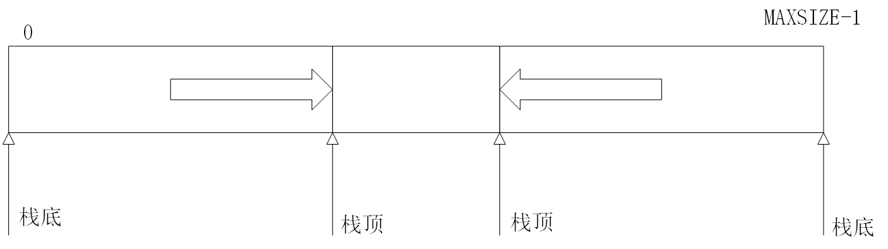

- 判断栈满：`top0 - top1 = 1`
- 判断空栈：`top0 == 0 `OR `top1 == MAXSIZE-1`


## 栈与递归


## 队列的定义和特点

**队列**（queue）是限定仅在表的一端进行插入操作，而在另一端进行删除操作的线性表。在队列中，允许插入的一端称为**队尾**（rear），允许删除的一端则称为**队头**（front）。

队列的修改是遵循先进先出的原则，因此又称为先进先出的线性表（简称FIFO结构）。

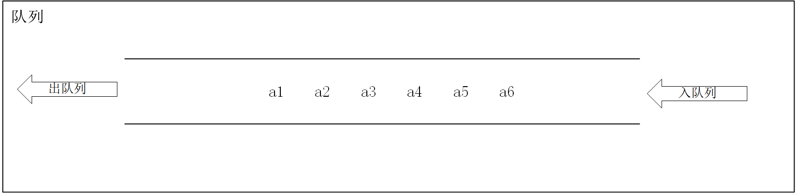


## 队列的表示和操作的实现


### 顺序队列的表示和实现

队列的顺序实现是指分配一块连续的存储空间存放队列元素，并附设两个指针：队头指针`front`和队尾指针`rear`。

- 队空：`Q.front = Q.rear = 0`
- 出队操作：队不为空时，`Q.front = Q.front + 1`
- 入队操作：队未满时，`Q.rear = Q.rear + 1`

```c++
#define MAXSIZE 50  // 定义队列最大长度
typedef int QElemType;  // 定义队列元素类型

// 循环队列结构体
typedef struct {
    QElemType data[MAXSIZE];  // 存储队列元素的数组
    int front;  // 队首指针
    int rear;   // 队尾指针
} SqQueue;
```


### 循环队列的表示和实现

把存储队列元素的表从逻辑上视为一个环，称为循环队列。

- 队空：`Q.front == Q.rear`
- 队满：`(Q.rear + 1) % MAXSIZE == Q.font`
- 出队操作：`Q.front = (Q.front + 1) % MAXSIZE`
- 入队操作：`Q.rear = (Q.rear + 1) % MAXSIZE`
- 队列长度：`(Q.rear - Q.front + MAXSIZE) % MAXSIZE`

这种实现牺牲了一个存储单元来区分队空和队满，约定以“队头指针在队尾指针的下一位置作为队满的标志”。

```c++
#define MAXSIZE 50  // 定义队列最大长度
typedef int QElemType;  // 定义队列元素类型

// 循环队列结构体
typedef struct {
    QElemType data[MAXSIZE];  // 存储队列元素的数组
    int front;  // 队首指针
    int rear;   // 队尾指针
} CircularQueue;

// 初始化队列
void InitQueue(CircularQueue *Q) {
    Q->front = 0;  // 初始化队首指针
    Q->rear = 0;   // 初始化队尾指针
}

// 判断队列是否为空
int QueueEmpty(CircularQueue Q) {
    return Q.front == Q.rear;
}

// 判断队列是否满
int QueueFull(CircularQueue Q) {
    return (Q.rear + 1) % MAXSIZE == Q.front;
}

// 入队操作
int EnQueue(CircularQueue *Q, QElemType e) {
    if (QueueFull(*Q)) {
        printf("队列已满，无法入队！\n");
        return 0;  // 队满则返回失败
    }
    Q->data[Q->rear] = e;  // 将元素放入队尾
    Q->rear = (Q->rear + 1) % MAXSIZE;  // 队尾指针向后移动
    return 1;  // 入队成功
}

// 出队操作
int DeQueue(CircularQueue *Q, QElemType *e) {
    if (QueueEmpty(*Q)) {
        printf("队列为空，无法出队！\n");
        return 0;  // 队空则返回失败
    }
    *e = Q->data[Q->front];  // 获取队首元素
    Q->front = (Q->front + 1) % MAXSIZE;  // 队首指针向后移动
    return 1;  // 出队成功
}

// 获取队列长度
int QueueLength(CircularQueue Q) {
    return (Q.rear - Q.front + MAXSIZE) % MAXSIZE;
}
```


# 串、数组和广义表


## 串

### 串的定义

串（string）（或字符串）是由零个或多个字符组成的有限序列，一般记为
$$
s = a_1a_2 \ldots a_n, \quad n \geq 0
$$
其中，s是串的名，用双引号括起来的字符序列是串的值；ai(1≤i≤n)可以是字母、数字或其他字符；

**串的长度**：串中字符的数目n。

**空串**（null string）：零个字符的串，其长度为零，一般用符号“Ø”来表示空串。

**串的相等**：当两个串的长度相等，并且各个对应位置的字符都相等时才相等

**空格串**：由一个或多个空格组成的串“ ”。


### 串的模式匹配算法

子串的定位运算通常称为串的模式匹配或串匹配。


1．BF算法

【算法步骤】

① 分别利用计数指针i和j指示主串S和模式T中当前正待比较的字符位置，i初值为pos，j初值为1。

② 如果两个串均未比较到串尾，即i和j均分别小于等于S和T的长度时，则循环执行以下操作：

- S.ch[i]和T.ch[j]比较，若相等，则i和j分别指示串中下个位置，继续比较后续字符；

- 若不等，指针后退重新开始匹配，从主串的下一个字符（i=i-j+2）起再重新和模式的第一个字符（j=1）比较。

③ 如果j>T.length，说明模式T中的每个字符依次和主串S中的一个连续的字符序列相等，则匹配成功，返回和模式T中第一个字符相等的字符在主串S中的序号（i-T.length）；否则称匹配不成功，返回0。

```c++
int Index_BF(SString S,SString T,int pos)
{//返回模式T在主串S中第pos个字符开始第一次出现的位置。若不存在，则返回值为0  
 //其中，T非空，1≤pos≤S.length 
   i=pos; j=1;                         //初始化 
   while(i<=S.length && j<=T.length)  //两个串均未比较到串尾 
   {  
      if(S[i].ch==T[j].ch){++i;++j;}   //继续比较后继字符  
      else{i=i-j+2;j=1;}               //指针后退重新开始匹配 
   }    
   if(j>T.length) return i-T.length;  //匹配成功 
   else return 0;                      //匹配失败 
}
```

【算法分析】

（1）最好情况下，每趟不成功的匹配都发生在模式串的第一个字符与主串中相应字符的比较。

设主串的长度为n，子串的长度为m，假设从主串的第i个位置开始与模式串匹配成功，则在前i−1趟匹配中字符总共比较了i−1次；若第i趟成功的字符比较次数为m，则总比较次数为i−1+m。对于成功匹配的主串，其起始位置由1到n−m+1，假定这n−m+1个起始位置上的匹配成功概率相等，则最好的情况下匹配成功的平均比较次数为
$$
\sum_{i=1}^{n-m+1} p_i (i - 1 + m) = \frac{1}{n - m + 1} \sum_{i=1}^{n-m+1} i - 1 + m = \frac{1}{2} (n + m)
$$
最好情况下的平均时间复杂度是O(n+m)。

（2）最坏情况下，每趟不成功的匹配都发生在模式串的最后一个字符与主串中相应字符的比较。

假设从主串的第i个位置开始与模式串匹配成功，则在前i−1趟匹配中字符总共比较了(i−1) ×m次；若第i趟成功的字符比较次数为m，则总比较次数i×m。因此最坏情况下匹配成功的平均比较次数为
$$
\sum_{i=1}^{n-m+1} p_i (i \times m) = \frac{1}{n - m + 1} \sum_{i=1}^{n-m+1} i \times m = \frac{1}{2} m \times (n - m + 2)
$$
即最坏情况下的平均时间复杂度是O(n ×m)。

2．KMP算法

这种改进算法是由Knuth、Morris和Pratt同时设计实现的，因此简称KMP算法。此算法可以在O(n+m)的时间数量级上完成串的模式匹配操作。其改进在于：每当一趟匹配过程中出现字符比较不等时，不需回溯i指针，而是利用已经得到的“部分匹配”的结果将模式向右“滑动”尽可能远的一段距离后，继续进行比较。

【算法描述】

```c++
int Index_KMP(SString S,SString T,int pos)
{//利用模式串T的next函数求T在主串S中第pos个字符之后的位置    
 //其中，T非空，1≤pos≤S.length 
   i=pos;j=1;    
   while(i<=S.length && j<=S.length)   //两个串均未比较到串尾 
   {    
      if(j==0‖S[i]==T[j]){++i;++j;}     //继续比较后继字符    
      else j=next[j];                   //模式串向右移动    
   }    
   if(j>T[0]) return i-T[0];           //匹配成功    
   else return 0;                      //匹配失败 
} 
```

计算next函数值

【算法描述】

```c++
void get_next(SString T,int next[])
{//求模式串T的next函数值并存入数组next
   i=1;next[1]=0;j=0；
   while(i<T.length)
   {
     if(j==0‖T.ch[i]==T.ch[j]){++i;++j;next[i]=j;}
     else j=next[j];
    }
}
```


计算next函数修正值

【算法描述】

```c++
void get_nextval(SString T，int nextval[])
{//求模式串T的next函数修正值并存入数组nextval
   i=1;nextval［1］=0;j=0;
   while(i<T.length)
   {
     if(j==0‖T.ch[i]==T.ch[j])
     {
        ++i;++j; 
        if(T.ch[i]!=T.ch[j]) nextval[i]=j;
        else  nextval[i]=nextval[j];
     }
         else j=nextval[j];
   }
}
```


## 数组


### 数组的顺序存储

建立数组后，结构中的数据元素个数和元素之间的关系就不再发生变动。因此，采用顺序存储结构表示数组比较合适。

数组的两种顺序存储方式：

- 以列序为主序的存储方式；
- 以行序为主序的存储方式。

假设每个数据元素占L个存储单元，则二维数组A[0.. m−1, 0.. n−1]（即下标从0开始，共有m行n列）中任一元素aij的存储位置可由下式确定
$$
\text{LOC}(i, j) = \text{LOC}(0, 0) + (n \cdot i + j) L
$$


### 特殊矩阵的压缩存储

**对称矩阵的压缩存储**

若n阶矩阵A中的元满足下述性质
$$
a_{ij} = a_{ji}, \quad 1 \leq i, j \leq n
$$
则称为n阶对称矩阵。

对于对称矩阵，可以为每一对对称元分配一个存储空间，则可将n2个元压缩存储到n(n+1)/2个元的空间中，不失一般性，可以行序为主序存储其下三角（包括对角线）中的元。

假设以一维数组sa[n(n+1)/2]作为n阶对称矩阵A的存储结构，则sa[k]和矩阵元aij之间存在着一一对应的关系：
$$
k =
\begin{cases} 
\frac{i(i-1)}{2} + j - 1, & \text{当 } i \geq j \\[10pt]
\frac{j(j-1)}{2} + i - 1, & \text{当 } i < j
\end{cases}
$$
**三角矩阵的压缩存储**

以主对角线划分，三角矩阵有上三角矩阵和下三角矩阵两种。上三角矩阵是指矩阵下三角（不包括对角线）中的元均为常数c或零的n阶矩阵，下三角矩阵与之相反。

对三角矩阵进行压缩存储时，除了和对称矩阵一样，只存储其上（下）三角中的元素之外，再加一个存储常数c的存储空间即可。

（1）上三角矩阵

sa[k]和矩阵元aij之间的对应关系为
$$
k =
\begin{cases} 
\frac{(i-1)(2n-i+2)}{2} + (j - i), & \text{当 } i \leq j \\[10pt]
\frac{n(n+1)}{2}, & \text{当 } i > j
\end{cases}
$$
（2）下三角矩阵sa[k]和矩阵元aij之间的对应关系为
$$
k =
\begin{cases} 
\frac{i(i-1)}{2} + j - 1, & \text{当 } i \geq j \\[10pt]
\frac{n(n+1)}{2}, & \text{当 } i <j
\end{cases}
$$
**对角矩阵的压缩存储**

对角矩阵所有的非零元都集中在以主对角线为中心的带状区域中，即除了主对角线上和直接在对角线上、下方若干条对角线上的元之外，所有其他的元皆为零。

​                                    

### 稀疏矩阵的压缩存储

1. 三元组顺序表

   稀疏矩阵的三元组顺序表存储表示                   

```c++
#define MAXSIZE 12500           // 假设非零元个数的最大值为12500
typedef struct
{
    int i, j;                   // 该非零元的行下标和列下标
    ElemType e;

} Triple;
typedef struct
{
    Triple data[MAXSIZE+1];     // 非零元三元组表，data[o]未用
    int mu, nu, tu;             // 矩阵的行数、列数和非零元个数
} TSMatrix;
```

在此，`data`域中表示非零元的三元组是以行序为主序顺序排列的，便于进行依行顺序处理的矩阵运算。                                                                                                                                   

2. 行逻辑链接的顺序表

```c++
typedef struct
{
    Triple data[MAXSIZE+1];     // 非零元三元组表，data[o]未用
    int rpos[MAXRC+1];          // 各行第一个非零元的位置表
    int mu, nu, tu;             // 矩阵的行数、列数和非零元个数
} TSMatrix;
```


3. 十字链表


```c++
typedef struct OLNode {
    int                      i, j;			// 非零元的横纵坐标
    ElemType                    e;          // 非零元的值
    struct OLNode * right, * down;			// 非零元所在行表和列表的后继链域
}OLNode, * OLink;
typedef struct {
    OLink        * rhead, * chead;			// 行和列链表头指针向量
    int                mu, nu, tu;			// 稀疏矩阵的行数、列数和非零元个数
}CroosList;
```

​                                                                                           

##  小结

### 串

串是内容受限的线性表，它限定了表中的元素为字符。串有两种基本存储结构：顺序存储和链式存储，但多采用顺序存储结构。

串的常用算法是模式匹配算法，主要有BF算法和KMP算法。BF算法实现简单，但存在回溯，效率低，时间复杂度为O(m×n)。KMP算法对BF算法进行改进，消除回溯，提高了效率，时间复杂度为O(m+n)。

### 数组

多维数组可以看成是线性表的推广，其特点是结构中的元素本身可以是具有某种结构的数据，但属于同一数据类型。一个n维数组实质上是n个线性表的组合，其每一维都是一个线性表。数组一般采用顺序存储结构，故存储多维数组时，应先将其确定转换为一维结构，有按“行”转换和按“列”转换两种。

科学与工程计算中的矩阵通常用二维数组来表示，为了节省存储空间，对于几种常见形式的特殊矩阵，比如对称矩阵、三角矩阵和对角矩阵，在存储时可进行压缩存储，即为**多个值相同的元只分配一个存储空间，对零元不分配空间**。

### 广义表

广义表是另外一种线性表的推广形式，表中的元素可以是称为原子的单个元素，也可以是一个子表，所以线性表可以看成广义表的特例。广义表的结构相当灵活，在某种前提下，它可以兼容线性表、数组、树和有向图等各种常用的数据结构。

广义表的常用操作有取表头和取表尾。广义表通常采用链式存储结构：头尾链表的存储结构和扩展线性链表的存储结构。


# 树和二叉树

树结构是一类重要的非线性数据结构，是以分支关系定义的层次结构。

## 树和二叉树的定义

**树**（Tree）是n（n≥0）个结点的有限集，它或为空树（n=0）；或为非空树，对于非空树T：（1）有且仅有一个称之为根的结点；（2）除根结点以外的其余结点可分为m（m>0）个互不相交的有限集T1,T2, …, Tm,其中每一个集合本身又是一棵树，并且称为根的子树（SubTree）。

> 树的结构定义是一个递归的定义，即在树的定义中又用到树的定义，它道出了树的固有特性。

**结点**：树中的一个独立单元。

**结点的度**：结点拥有的子树数称为结点的度。

**叶子**：度为0的结点称为叶子或终端结点。

**非终端结点**：度不为0的结点称为非终端结点或分支结点。除根结点之外，非终端结点也称为内部结点。

**双亲和孩子**：结点的子树的根称为该结点的孩子，相应地，该结点称为孩子的双亲。

**兄弟**：同一个双亲的孩子之间互称兄弟。

**祖先**：从根到该结点所经分支上的所有结点。

**子孙**：以某结点为根的子树中的任一结点都称为该结点的子孙。

**层次**：结点的层次从根开始定义起，根为第一层，根的孩子为第二层。树中任一结点的层次等于其双亲结点的层次加1。

**堂兄弟**：双亲在同一层的结点互为堂兄弟。

**树的深度**：树中结点的最大层次称为树的深度或高度。

**有序树和无序树**：如果将树中结点的各子树看成从左至右是有次序的（即不能互换），则称该树为有序树，否则称为无序树。

**森林**：是m（m≥0）棵互不相交的树的集合。

---

**二叉树**（Binary Tree）是n（n≥0）个结点所构成的集合，它或为空树（n=0）；或为非空树，对于非空树T：

（1）有且仅有一个称之为根的结点；

（2）除根结点以外的其余结点分为两个互不相交的子集T1和T2，分别称为T的左子树和右子树，且T1和T2本身又都是二叉树。

> 二叉树中不存在度大于2的结点；
>
> 二叉树的子树有左右之分，其次序不能任意颠倒，是有序树。

## 二叉树的性质

**性质1** 在二叉树的第i层上至多有$2^{i−1}$个结点（i≥1）。

**性质2** 深度为k的二叉树至多有$2^k−1$个结点（k≥1）。

**性质3** 对任何一棵二叉树T，如果其终端结点数为n0，度为2的结点数为n2，则n0=n2+1。

**满二叉树**：深度为k且含有$2^k−1$个结点的二叉树。


## 遍历二叉树


## 线索二叉树

若结点有左子树，则其lchild域指示其左孩子，否则令lchild域指示其前驱；若结点有右子树，则其rchild域指示其右孩子，否则令rchild域指示其后继。为了避免混淆，尚需改变结点结构，增加两个标志域。

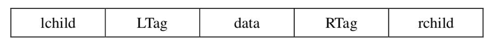
$$
\text{LTag} =
\begin{cases} 
0, & \text{lchild 域指示结点的左孩子} \\ 
1, & \text{lchild 域指示结点的前驱} 
\end{cases}
$$

$$
\text{RTag} =
\begin{cases} 
0, & \text{rchild 域指示结点的右孩子} \\ 
1, & \text{rchild 域指示结点的后继} 
\end{cases}
$$


# 图

在图结构中，结点之间的关系可以是任意的，图中任意两个数据元素之间都可能相关。

## 图的定义和基本术语

**图**（Graph）G由两个集合V和E组成，记为G=(V, E)，其中V是顶点的有穷非空集合，E是V中顶点偶对的有穷集合，这些顶点偶对称为边。V(G)和E(G)通常分别表示图G的顶点集合和边集合，E(G)可以为空集。若E(G)为空，则图G只有顶点而没有边。

**无向图和有向图**：对于图G，若边集E(G)为有向边的集合，则称该图为有向图；若边集E(G)为无向边的集合，则称该图为无向图。

**子图**：假设有两个图G=(V, E)和G′=(V′, E′)，如果V′∈V且E′∈E，则称G′为G的子图。

**无向完全图**：若具有n(n−1)/2条边，则称为无向完全图。

**有向完全图**：若具有n(n−1)条弧，则称为有向完全图。

**稀疏图和稠密图**：有很少条边或弧（如e<nlog2n）的图称为稀疏图，反之称为稠密图。

**权和网**：在实际应用中，每条边可以标上具有某种含义的数值，该数值称为该边上的权。这些权可以表示从一个顶点到另一个顶点的距离或耗费。这种带权的图通常称为网。

**邻接点**：对于无向图G，如果图的边(v, v′)∈E，则称顶点v和v′互为邻接点，即v和v′**相邻接**。边(v, v′)**依附于**顶点v和v′，或者说边(v, v′)与顶点v和v′**相关联**。

**度、入度和出度**：顶点v的度是指和v相关联的边的数目，记为TD(v)。对于有向图，顶点v的度分为入度和出度。入度是以顶点v为头的弧的数目，记为ID(v)；出度是以顶点v为尾的弧的数目，记为OD(v)。顶点v的度为TD(v)=ID(v)+OD(v)。

**路径**：在无向图G中，从顶点v到顶点v′的路径是一个顶点序列。

**路径长度**：路径长度是一条路径上经过的边或弧的数目。

**回路或环**：第一个顶点和最后一个顶点相同的路径称为回路或环。

**简单路径、简单回路或简单环**：序列中顶点不重复出现的路径称为简单路径。除了第一个顶点和最后一个顶点之外，其余顶点不重复出现的回路，称为简单回路或简单环。

**连通、连通图**：在无向图G中，如果从顶点v到顶点v′有路径，则称v和v′是连通的。如果对于图中任意两个顶点vi、vj∈V，vi和vj都是连通的，则称G是连通图。

**连通分量**：指的是无向图中的**极大连通子图**。

**强连通图和强连通分量**：在有向图G中，如果对于每一对vi,vj∈V,vi≠vj，从vi到vj和从vj到vi都存在路径，则称G是强连通图。有向图中的极大强连通子图称作有向图的强连通分量。

**连通图的生成树**：一个**极小连通子图**，它含有图中全部顶点，但只有足以构成一棵树的n−1条边，这样的连通子图称为连通图的生成树。

> 一棵有n个顶点的生成树有且仅有n−1条边。如果一个图有n个顶点和小于n−1条边，则是非连通图。如果它多于n−1条边，则一定有环。但是，有n−1条边的图不一定是生成树。

**有向树和生成森林**：有一个顶点的入度为0，其余顶点的入度均为1的有向图称为有向树。一个有向图的生成森林是由若干棵有向树组成，含有图中全部顶点，但只有足以构成若干棵不相交的有向树的弧。


## 图的存储结构

### 邻接矩阵

**邻接矩阵**（Adjacency Matrix）是表示顶点之间相邻关系的矩阵。设G(V, E)是具有n个顶点的图，则G的邻接矩阵是具有如下性质的n阶方阵

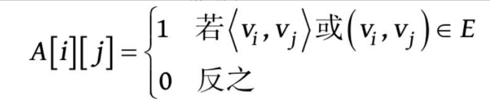

若G是网，则邻接矩阵可以定义为

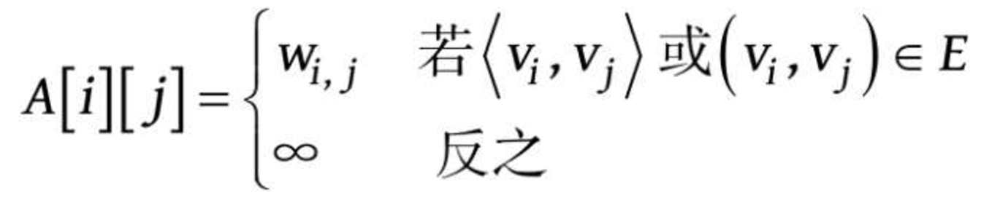

```c++
//-----图的邻接矩阵存储表示-----
#define MaxInt 32767                    //表示极大值，即∞
#define MVNum 100                       //最大顶点数
typedef char VerTexType;                //假设顶点的数据类型为字符型
typedef int ArcType;                    //假设边的权值类型为整型
typedef struct
{
   VerTexType vexs[MVNum];              //顶点表
   ArcType arcs[MVNum][MVNum];          //邻接矩阵
   int vexnum,arcnum;                   //图的当前点数和边数
}AMGraph;
```

- 邻接矩阵表示法的优点

① 便于判断两个顶点之间是否有边，即根据A\[i\]\[j\]=0或1来判断。

② 便于计算各个顶点的度。对于无向图，邻接矩阵第i行元素之和就是顶点i的度；对于有向图，第i行元素之和就是顶点i的出度，第i列元素之和就是顶点i的入度。

- 邻接矩阵表示法的缺点

① 不便于增加和删除顶点。

② 不便于统计边的数目，需要扫描邻接矩阵所有元素才能统计完毕，时间复杂度为O(n^2)。

③ 空间复杂度高。如果是有向图，n个顶点需要n2个单元存储边。如果是无向图，因其邻接矩阵是对称的，所以对规模较大的邻接矩阵可以采用压缩存储的方法，仅存储下三角（或上三角）的元素，这样需要n(n−1)/2个单元即可。但无论以何种方式存储，邻接矩阵表示法的空间复杂度均为O(n2)，这对于稀疏图而言尤其浪费空间。

### 邻接表

**邻接表**（Adjacency List）是图的一种链式存储结构。在邻接表中，对图中每个顶点vi建立一个单链表，把与vi相邻接的顶点放在这个链表中。邻接表中每个单链表的第一个结点存放有关顶点的信息，把这一结点看成链表的表头，其余结点存放有关边的信息，这样邻接表便由两部分组成：表头结点表和边表。

**表头结点表**：由所有表头结点以顺序结构的形式存储，以便可以随机访问任一顶点的边链表。表头结点包括数据域（data）和链域（firstarc）两部分。其中，数据域用于存储顶点vi的名称或其他有关信息；链域用于指向链表中第一个结点（即与顶点vi邻接的第一个邻接点）。

**边表**：由表示图中顶点间关系的2n个边链表组成。边链表中边结点包括**邻接点域**（adjvex）、**数据域**（info）和**链域**（nextarc）三部分。其中，邻接点域指示与顶点vi邻接的点在图中的位置；数据域存储和边相关的信息，如权值等；链域指示与顶点vi邻接的下一条边的结点。

在无向图的邻接表中，顶点vi的度恰为第i个链表中的结点数；

而在有向图中，第i个链表中的结点个数只是顶点vi的出度，为求入度，必须遍历整个邻接表。在所有链表中，其邻接点域的值为i的结点的个数是顶点vi的入度。

有时，为了便于确定顶点的入度，可以建立一个有向图的逆邻接表，即对每个顶点vi建立一个链接所有进入vi的边的表。

```c++
//- - - - -图的邻接表存储表示- - - - -
#define MVNum 100                         //最大顶点数  
typedef struct ArcNode                    //边结点 
{                   
   int adjvex;                           //该边所指向的顶点的位置  
   struct ArcNode * nextarc;             //指向下一条边的指针  
   OtherInfo info;                       //和边相关的信息  
}ArcNode;  
typedef struct VNode                     //顶点信息 
{  
   VerTexType data;    
   ArcNode *firstarc;                   //指向第一条依附该顶点的边的指针  
}VNode,AdjList[MVNum];                  //AdjList表示邻接表类型  
typedef struct                          //邻接表 
{  
    AdjList vertices;                    
    int vexnum,arcnum;                 //图的当前顶点数和边数  
}ALGraph;
```

> 注意:
>
> 一个图的邻接矩阵表示是唯一的，但其邻接表表示不唯一，这是因为邻接表表示中，各边表结点的链接次序取决于建立邻接表的算法，以及边的输入次序。

- 邻接表表示法的优点

① 便于增加和删除顶点。

② 便于统计边的数目，按顶点表顺序扫描所有边表可得到边的数目，时间复杂度为O(n+e)。

③ 空间效率高。对于一个具有n个顶点e条边的图G，若G是无向图，则在其邻接表表示中有n个顶点表结点和2e个边表结点；若G是有向图，则在它的邻接表表示或逆邻接表表示中均有n个顶点表结点和e个边表结点。因此，邻接表或逆邻接表表示的空间复杂度为O(n+e)，适合表示稀疏图。对于稠密图，考虑到邻接表中要附加链域，因此常采取邻接矩阵表示法。

- 邻接表表示法的缺点

① 不便于判断顶点之间是否有边，要判定vi和vj之间是否有边，就需扫描第i个边表，最坏情况下要耗费O(n)时间。

② 不便于计算有向图各个顶点的度。对于无向图，在邻接表表示中顶点vi的度是第i个边表中的结点个数。在有向图的邻接表中，第i个边表上的结点个数是顶点vi的出度，但求vi的入度较困难，需遍历各顶点的边表。若有向图采用逆邻接表表示，则与邻接表表示相反，求顶点的入度容易，而求顶点的出度较难。


### 十字链表

**十字链表**（Orthogonal List）是**有向图的另一种链式存储结构**。可以看成是将有向图的邻接表和逆邻接表结合起来得到的一种链表。在十字链表中，对应于有向图中每一条弧有一个结点，对应于每个顶点也有一个结点。

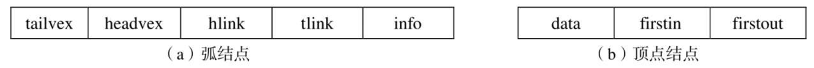

弧结点：

尾域`tailvex`：指示弧尾顶点在图中的位置；

头域`headvex`：指示弧头顶点在图中的位置；

链域`hlink`：指向弧头`headvex`相同的下一条弧；

链域`tlink`：指向弧尾`tailvex`相同的下一条弧；

`info`域：指向该弧的相关信息。

顶点结点：

`data`域：存储和顶点相关的信息；

链域`firstin`：指向以该顶点为弧头的第一个弧结点；

链域`firstout`：指向以该顶点弧尾的第一个弧结点。

> 若将有向图的邻接矩阵看成是稀疏矩阵的话，则十字链表也可以看成是邻接矩阵的链式存储结构；
>
> 在图的十字链表中，弧结点所在的链表非循环链表，结点之间相对位置自然形成，不一定按顶点序号有序，表头结点即顶点结点，它们之间不是链接，而是顺序存储。

```c++
//- - - - -有向图的十字链表存储表示- - - - -
#define MAX_VERTEX_NUM  20
typedef struct ArcBox
{
   int tailvex,headvex;                 //该弧的尾和头顶点的位置
   struct ArcBox *hlink, *tlink;        //分别为弧头相同和弧尾相同的弧的链域
   InfoType *info;                      //该弧相关信息的指针
}ArcBox;
typedef struct VexNode
{
   VertexType data;
   ArcBox *firstin,*firstout;           //分别指向该顶点第一条入弧和出弧
}VexNode;
typedef struct
{
   VexNode xlist[MAX_VERTEX_NUM];       //表头向量
   int vexnum, arcnum;                  //有向图的当前顶点数和弧数
}OLGraph;
```

十字链表相比于邻接表更便于求得顶点的入度和出度。


### 邻接多重表

**邻接多重表**（Adjacency Multilist）是**无向图的另一种链式存储结构**。邻接多重表的结构和十字链表类似。在邻接多重表中，每一条边用一个结点表示。

边结点：

标志域`mark`：用以标记该条边是否被搜索过;

`ivex`域和`jvex`域：为该边依附的两个顶点在图中的位置；

链域`ilink`：指向下一条依附于顶点`ivex`的边；

链域`jlink`：指向下一条依附于顶点`jvex`的边，

`info`域：为指向和边相关的各种信息的指针域。

顶点结点：

`data`域：存储和该顶点相关的信息；

`firstedge`域：指示第一条依附于该顶点的边。

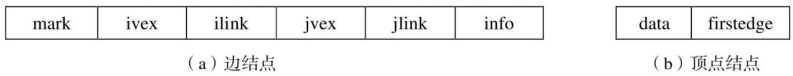

```c++
//- - - - -无向图的邻接多重表存储表示- - - - -
#define MAX_VERTEX_NUM  20
typedef enum{unvisited,visited} VisitIf;
typedef struct EBox
{
   VisitIf mark;                                //访问标记
   int ivex, jvex;                              //该边依附的两个顶点的位置
   struct EBox *ilink, *jlink;                  //分别指向依附这两个顶点的下一条边
   InfoType *info;                              //该边信息指针
}Ebox;
typedef struct VexBox
{
   VertexType data;
   EBox *firstedge;                             //指向第一条依附该顶点的边
}VexBox;
typedef struct{
   VexBox adjmulist[MAX_VERTEX_NUM];
   int vexnum, edgenum;                         //无向图的当前顶点数和边数
}AMLGraph;
```

## 图的遍历


### 深度优先搜索

**深度优先搜索**（Depth First Search，DFS）遍历类似于树的先序遍历，是树的先序遍历的推广。

对于一个连通图，深度优先搜索遍历的过程如下。

（1）从图中某个顶点v出发，访问v。

（2）找出刚访问过的顶点的第一个未被访问的邻接点，访问该顶点。以该顶点为新顶点，重复此步骤，直至刚访问过的顶点没有未被访问的邻接点为止。（3）返回前一个访问过的且仍有未被访问的邻接点的顶点，找出该顶点的下一个未被访问的邻接点，访问该顶点。

（4）重复步骤（2）和（3），直至图中所有顶点都被访问过，搜索结束。

**深度优先搜索遍历连通图**

【算法步骤】

① 从图中某个顶点v出发，访问v，并置visited[v]的值为true。

② 依次检查v的所有邻接点w，如果visited[w]的值为false，再从w出发进行递归遍历，直到图中所有顶点都被访问过。

【算法描述】

```c++
bool visited[MVNum];                   //访问标志数组，其初值为“false”
void DFS(Graph G,int v)     
{//从第v个顶点出发递归地深度优先遍历图G             
   cout<<v;visited[v]=true;            //访问第v个顶点，并置访问标志数组相应分量值为true  
   for(w=FirstAdjVex(G,v);w>=0;w=NextAdjVex(G,v,w))   
   //依次检查v的所有邻接点w ，FirstAdjVex(G, v)表示v的第一个邻接点  
   //NextAdjVex(G,v,w)表示v相对于w的下一个邻接点，w≥0表示存在邻接点  
      if(!visited[w]) DFS(G,w);       //对v的尚未访问的邻接顶点w递归调用DFS  
}
```

若是非连通图，上述遍历过程执行之后，图中一定还有顶点未被访问，需要从图中另选一个未被访问的顶点作为起始点，重复上述深度优先搜索过程，直到图中所有顶点均被访问过为止。


**深度优先搜索遍历非连通图**

【算法描述】

```c++
void DFSTraverse(Graph G)
{//对非连通图G做深度优先遍历
   for(v=0;v<G.vexnum;++v) visited[v]=false;         //访问标志数组初始化
   for(v=0;v<G.vexnum;++v)                           //循环调用算法6.3
   if(!visited[v]) DFS(G,v);                         //对尚未访问的顶点调用DFS
}
```

> 调用一次`DFS`函数将遍历一个连通分量，有多少次调用，就说明图中有多少个连通分量。


### 广度优先搜索


## 图的应用


### 最小生成树

在一个连通网的所有生成树中，各边的代价之和最小的那棵生成树称为该连通网的最小代价生成树（Minimum Cost Spanning Tree），简称为**最小生成树**。

> 构造最小生成树有多种算法，其中多数算法利用了最小生成树的下列一种简称为MST的性质：假设N=(V, E)是一个连通网，U是顶点集V的一个非空子集。若(u, v)是一条具有最小权值（代价）的边，其中u∈U，v∈V−U，则必存在一棵包含边(u, v)的最小生成树。


#### Prim算法

普里姆算法的构造过程：

假设N=(V, E)是连通网，TE是N上最小生成树中边的集合。

① U={u0}(u0∈V)，TE={}。

② 在所有u∈U，v∈V−U的边(u, v)∈E中找一条权值最小的边(u0, v0)并入集合TE，同时v0并入U。

③ 重复②，直至U=V为止。此时TE中必有n−1条边，则T=(V, TE)为N的最小生成树。

普里姆算法的实现：

为实现`Prim`算法需附设一个辅助数组`closedge`，以记录从U到V−U具有最小权值的边。对每个顶点vi∈V−U，在辅助数组中存在一个相应分量`closedge[i-1]`，它包括两个域：`lowcost`和`adjvex`，其中`lowcost`存储最小边上的权值，`adjvex`存储最小边在U中的那个顶点。

【算法步骤】

① 首先将初始顶点u加入U中，对其余的每一个顶点vj，将`closedge[j]`均初始化为到u的边信息。

② 循环n−1次，做如下处理：

- 从各组边closedge中选出最小边closedge[k]，输出此边；
- 将k加入U中；
- 更新剩余的每组最小边信息closedge[j]，对于V−U中的边，新增加了一条从k到j的边，如果新边的权值比closedge[j].lowcost小，则将closedge[j].lowcost更新为新边的权值。

```c++
void MiniSpanTree_Prim(AMGraph G,VerTexType u)
{//无向网G以邻接矩阵形式存储，从顶点u出发构造G的最小生成树T，输出T的各条边      
   k=LocateVex(G,u);                           //k为顶点u的下标  
   for(j=0;j<G.vexnum;++j)                     //对V−U的每一个顶点vj，初始化closedge[j]  
      if(j!=k) closedge[j]={u,G.arcs[k][j]};   //{adjvex, lowcost}  
   closedge[k].lowcost=0;                      //初始，U={u}  
   for(i=1;i<G.vexnum;++i) 
   {//选择其余n-1个顶点，生成n-1条边(n=G.vexnum)  
      k=Min(closedge);        
      //求出T的下一个结点：第k个顶点，closedge[k]中存有当前最小边  
      u0=closedge[k].adjvex;                   //u0为最小边的一个顶点，u0∈U  
      v0=G.vexs[k];                            //v0为最小边的另一个顶点，v0∈V−U  
      cout<<u0<<v0;                            //输出当前的最小边(u0, v0)  
      closedge[k].lowcost=0;                   //第k个顶点并入U集  
      for(j=0;j<G.vexnum;++j)  
         if(G.arcs[k][j]<closedge[j].lowcost) //新顶点并入U后重新选择最小边  
            closedge[j]={G.vexs[k],G.arcs[k][j]};  
   }                                          //for  
}
```

【算法分析】

假设网中有n个顶点，则第一个进行初始化的循环语句`for(j=0;j<G.vexnum;++j)`的频度为n，第二个循环语句`for(i=1;i<G.vexnum;++i)`的频度为n−1。其中第二个有两个内循环：其一是在closedge[v].lowcost中求最小值，其频度为n−1；其二是重新选择具有最小权值的边，其频度为n。由此，普里姆算法的时间复杂度为O(n^2)，与网中的边数无关，因此适用于求**稠密网的最小生成树**。


#### Kruskal算法

克鲁斯卡尔（Kruskal）算法的构造过程：

假设连通网N=(V, E)，将N中的边按权值从小到大的顺序排列。

① 初始状态为只有n个顶点而无边的非连通图T=(V, {})，图中每个顶点自成一个连通分量。

② 在E中选择权值最小的边，若该边依附的顶点落在T中不同的连通分量上（即不形成回路），则将此边加入到T中，否则舍去此边而选择下一条权值最小的边。

③ 重复②，直至T中所有顶点都在同一连通分量上为止。


克鲁斯卡尔算法的实现：

算法的实现要引入以下辅助的数据结构。

① 结构体数组`Edge`：存储边的信息，包括边的两个顶点信息和权值。

```c++
//辅助数组Edges的定义
struct
{
   VerTexType Head;             //边的始点
   VerTexType Tail;             //边的终点
   ArcType lowcost;             //边上的权值
}Edge[arcnum];
```

② `Vexset[i]`：标识各个顶点所属的连通分量。对每个顶点vi∈V，在辅助数组中存在一个相应元素`Vexset[i]`表示该顶点所在的连通分量。初始时`Vexset[i]=i`，表示各顶点自成一个连通分量。

```c++
//辅助数组Vexset的定义
int Vexset[MVNum];
```

【算法步骤】

① 将数组`Edge`中的元素按权值从小到大排序。

② 依次查看数组`Edge`中的边，循环执行以下操作：

- 依次从排好序的数组`Edge`中选出一条边(U1, U2)；
- 在`Vexset`中分别查找v1和v2所在的连通分量vs1和vs2，进行判断：
  - 如果vs1和vs2不等，表明所选的两个顶点分属不同的连通分量，输出此边，并合并vs1和vs2两个连通分量；
  - 如果vs1和vs2相等，表明所选的两个顶点属于同一个连通分量，舍去此边而选择下一条权值最小的边。

```c++
void MiniSpanTree_ Kruskal(AMGraph G)
{//无向网G以邻接矩阵形式存储，构造G的最小生成树T，输出T的各条边 
   Sort(Edge);                              //将数组Edge中的元素按权值从小到大排序  
   for(i=0;i<G.vexnum;++i)                  //辅助数组，表示各顶点自成一个连通分量  
      Vexset[i]=i;        
   for(i=0;i<G.arcnum;++i)                  //依次查看数组Edge中的边 
   {       
      v1=LocateVex(G,Edge[i].Head);         //v1为边的始点Head的下标  
      v2=LocateVex(G,Edge[i].Tail);         //v2为边的终点Tail的下标  
      vs1=Vexset[v1];                       //获取边Edge[i]的始点所在的连通分量vs1  
      vs2=Vexset[v2];                       //获取边Edge[i]的终点所在的连通分量vs2  
      if(vs1!=vs2)                          //边的两个顶点分属不同的连通分量 
      {             
         cout<< Edge[i].Head << Edge[i].Tail;//输出此边  
         for(j=0;j<G.vexnum;++j)            //合并vs1和vs2两个分量，即两个集合统一编号  
         if(Vexset[j]==vs2) Vexset[j]=vs1;  //集合编号为vs2的都改为vs1 
     }                                      //if  
   }                                        //for  
}
```

【算法分析】

“堆”来存放网中的边进行堆排序，对于包含e条边的网，上述算法排序时间是O(elog2e)。

在for循环中最耗时的操作是合并两个不同的连通分量，只要采取合适的数据结构，可以证明其执行时间为O(log2e)，因此整个for循环的执行时间是O(elog2e)。

由此，克鲁斯卡尔算法的时间复杂度为O(elog2e)，与网中的边数有关，与普里姆算法相比，克鲁斯卡尔算法更适合于求**稀疏网的最小生成树**。


### 最短路径

#### Dijkstra算法

迪杰斯特拉算法的求解过程:

对于网N=(V, E)，将N中的顶点分成两组：

第一组S：已求出的最短路径的终点集合（初始时只包含源点v0）。

第二组V−S：尚未求出的最短路径的顶点集合（初始时为V−{v0}）。

算法将按各顶点与v0间最短路径长度递增的次序，逐个将集合V−S中的顶点加入到集合S中去。在这个过程中，总保持从v0到集合S中各顶点的路径长度始终不大于到集合V−S中各顶点的路径长度。

```c++
void ShortestPath_DIJ(AMGraph G, int v0)
{//用Dijkstra算法求有向网G的v0顶点到其余顶点的最短路径 
   n=G.vexnum;                          //n为G中顶点的个数  
   for(v=0;v<n;++v)                     //n个顶点依次初始化 
   {                 
      S[v]=false;                       //S初始为空集  
      D[v]=G.arcs[v0][v];               //将v0到各个终点的最短路径长度初始化为弧上的权值  
      if(D[v]<MaxInt) Path[v]=v0;       //如果v0和v之间有弧，则将v的前驱置为v0  
      else Path[v]=-1;                  //如果v0和v之间无弧，则将v的前驱置为-1  
   }                                    //for  
   S[v0]=true;                          //将v0加入S  
   D[v0]=0;                             //源点到源点的距离为0  
/*--------初始化结束，开始主循环，每次求得v0到某个顶点v的最短路径，将v加到S集---------*/  
   for(i=1;i<n;++i)                     //对其余n−1个顶点，依次进行计算 
   {                   
      min=MaxInt;  
      for(w=0;w<n;++w) 
         if(!S[w]&&D[w]<min)   
            {v=w;min=D[w];}            //选择一条当前的最短路径，终点为v  
      S[v]=true;                       //将v加入S  
      for(w=0;w<n;++w)                 //更新从v0出发到集合V−S上所有顶点的最短路径长度  
         if(!S[w]&&(D[v]+G.arcs[v][w]<D[w])) 
         {  
             D[w]=D[v]+G.arcs[v][w];   //更新D[w]  
             Path[w]=v;                //更改w的前驱为v  
          }                            //if  
   }                                  //for  
}
```

【算法分析】

最短路径的主循环共进行n−1次，每次执行的时间是O(n)，所以算法的时间复杂度是O(n\^2)。如果用带权的邻接表作为有向图的存储结构，则虽然修改D的时间可以减少，但由于在D向量中选择最小分量的时间不变，所以时间复杂度仍为O(n\^2)。


#### Floyd算法

弗洛伊德算法仍然使用带权的邻接矩阵arcs来表示有向网G，求从顶点vi到vj的最短路径。算法的实现要引入以下辅助的数据结构。

（1）二维数组`Path[i][j]`：最短路径上顶点vj的前一顶点的序号。

（2）二维数组`D[i][j]`：记录顶点vi和vj之间的最短路径长度。

```c++
void ShortestPath_Floyd(AMGraph G)
{//用Floyd算法求有向网G中各对顶点i和j之间的最短路径  
   for(i=0;i<G.vexnum;++i)                  //各对结点之间初始已知路径及距离  
      for(j=0;j<G.vexnum;++j) 
      {  
          D[i][j]=G.arcs[i][j];  
          if(D[i][j]<MaxInt) Path[i][j]=i;   //如果i和j之间有弧，则将j的前驱置为i  
          else Path[i][j]=-1;               //如果i和j之间无弧，则将j的前驱置为-1  
        }                                   //for  
   for(k=0;k<G.vexnum;++k)  
      for(i=0;i<G.vexnum;++i)  
         for(j=0;j<G.vexnum;++j)  
            if(D[i][k]+D[k][j]<D[i][j])   //从i经k到j的一条路径更短 
            {  
               D[i][j]=D[i][k]+D[k][j];   //更新D[i][j]  
               Path[i][j]=Path[k][j];     //更改j的前驱为k  
             }                            //if  
}
```


### 拓扑排序

**有向无环图**（Directed Acycline Graph）：一个无环的有向图，简称**DAG图**。

**AOV-网**（Activity On Vertex Network）：用顶点表示活动，用弧表示活动间的优先关系的有向图称为顶点表示活动的网。

> 在AOV-网中，不应该出现有向环，因为存在环意味着某项活动应以自己为先决条件。

**拓扑排序**：将AOV-网中所有顶点排成一个线性序列，该序列满足：若在AOV-网中由顶点vi到顶点vj有一条路径，则在该线性序列中的顶点vi必定在顶点vj之前。


拓扑排序的过程：

（1）在有向图中选一个无前驱的顶点且输出它。

（2）从图中删除该顶点和所有以它为尾的弧。

（3）重复（1）和（2），直至不存在无前驱的顶点。

（4）若此时输出的顶点数小于有向图中的顶点数，则说明有向图中存在环，否则输出的顶点序列即为一个拓扑序列。


### 关键路径

与AOV-网相对应的是**AOE-网**（Activity On Edge），即以边表示活动的网。

AOE-网是一个带权的有向无环图，其中，顶点表示事件，弧表示活动，权表示活动持续的时间。通常，AOE-网可用来估算工程的完成时间。

在AOE-网中：

- 只有一个入度为零的点，称作**源点**；

- 只有一个出度为零的点，称作**汇点**。

- 一条路径各弧上的权值之和称为该路径的**带权路径长度**（后面简称路径长度）。

从源点到汇点的带权路径长度最长的路径，称为**关键路径**（Critical Path）。关键路径上的活动叫做**关键活动**，这些活动是影响工程进度的关键，它们的提前或拖延将使整个工程提前或拖延。

如何确定关键路径，首先定义4个描述量。

（1）**事件vi的最早发生时间**`ve(i)`

进入事件vi的每一活动都结束，vi才可发生，所以`ve(i)`是从源点到vi的最长路径长度。

求`ve(i)`的值，可根据拓扑顺序从源点开始向汇点递推。通常将工程的开始顶点事件v0的最早发生时间定义为0，即
$$
\begin{aligned}
    &\text{初值：} \quad ve(0) = 0, \\[8pt]
    &\text{递推公式：} \quad ve(i) = \max\{ve(k) + w_{k,i} \mid (v_k, v_i) \in T\}, \quad 1 \leq i \leq n-1.
\end{aligned}
$$
其中，T是所有以vi为头的弧的集合，wk,i是弧<vk, vi>的权值，即对应活动<vk, vi>的持续时间。

（2）**事件vi的最迟发生时间**`vl(i)`

事件vi的发生不得延误vi的每一后继事件的最迟发生时间。为了不拖延工期，vi的最迟发生时间不得迟于其后继事件vk的最迟发生时间减去活动<vi,vk>的持续时间。

求出ve(i)后，可根据逆拓扑顺序从汇点开始向源点递推，求出`vl(i)`。
$$
\begin{aligned}
    &\text{初值：} \quad vl(n-1) = ve(n-1), \\[8pt]
    &\text{递推公式：} \quad vl(i) = \min\{vl(k) - w_{i,k} \mid (v_i, v_k) \in S\}, \quad 0 \leq i \leq n-2.
\end{aligned}
$$
其中，S是所有以vi为尾的弧的集合，wi,k是弧<vi, vk>的权值。

（3）**活动ai=<vj, vk>的最早开始时间**`e(i)`

只有事件vj发生了，活动ai才能开始。所以，活动ai的最早开始时间等于事件vj的最早发生时间`ve(j)`，即
$$
e(i)=ve(j)
$$
（4）**活动ai=<vj, vk>的最晚开始时间**`l(i)`

活动ai的开始时间需保证不延误事件vk的最迟发生时间。所以活动ai的最晚开始时间`l(i)`等于事件vk的最迟发生时间vl(k)减去活动ai的持续时间wj,k，即：
$$
l(i) = vl(k) - w_{j,k}
$$


# 查找


## 查找的基本概念

**查找表**：查找表是由同一类型的数据元素（或记录）构成的集合。

**关键字**：关键字是数据元素（或记录）中某个数据项的值，用它可以标识一个数据元素（或记录）。若此关键字可以唯一地标识一个记录，则称此关键字为**主关键字**（对不同的记录，其主关键字均不同）。反之，称用以识别若干记录的关键字为**次关键字**。当数据元素只有一个数据项时，其关键字即为该数据元素的值。

**查找**：查找是指根据给定的某个值，在查找表中确定一个其关键字等于给定值的记录或数据元素。若表中存在这样的一个记录，则称**查找成功**，此时查找的结果可给出整个记录的信息，或指示该记录在查找表中的位置；若表中不存在关键字等于给定值的记录，则称**查找不成功，**此时查找的结果可给出一个“空”记录或“空”指针。

**动态查找表和静态查找表**：若在查找的同时对表做修改操作（如插入和删除），则相应的表称之为**动态查找表**，否则称之为**静态查找表**。

> 换句话说，动态查找表的表结构本身是在查找过程中动态生成的，即在创建表时，对于给定值，若表中存在其关键字等于给定值的记录，则查找成功返回；否则插入关键字等于给定值的记录。

**平均查找长度**：为确定记录在查找表中的位置，需和给定值进行比较的关键字个数的期望值，称为查找算法在查找成功时的平均查找长度（Average Search Length，ASL）。

对于含有n个记录的表，查找成功时的平均查找长度为
$$
ASL = \sum_{i=1}^{n}{p_ic_i} \\
And\ \ \sum_{i=1}^{n}p_i = 1
$$
其中，Pi为查找表中第i个记录的概率；Ci为找到表中其关键字与给定值相等的第i个记录时，和给定值已进行过比较的关键字个数。显然，Ci随查找过程不同而不同。

> 由于查找算法的基本运算是关键字之间的比较操作，所以可用平均查找长度来衡量查找算法的性能。


## 线性表的查找


### 顺序查找

**顺序查找**（Sequential Search）的查找过程为：从表的一端开始，依次将记录的关键字和给定值进行比较，若某个记录的关键字和给定值相等，则查找成功；反之，若扫描整个表后，仍未找到关键字和给定值相等的记录，则查找失败。

```c++
int Search_Seq(SSTable ST,KeyType key)
{//在顺序表ST中顺序查找其关键字等于key的数据元素。若找到，则函数值为该元素在表中的位置，否则为0
   ST.R[0].key=key;                                             //“哨兵”
   for(i=ST.length;ST.R[i].key!=key;--i);                       //从后往前找
   return i;
}
```

【算法分析】

**查找成功时的平均查找长度**:
$$
ASL_{成功} = \frac{1}{n} \sum_{i=1}^{n}{i} = \frac{n+1}{2}
$$
**时间复杂度**：O(n)。

**顺序查找的优点**：算法简单，对表结构无任何要求，既适用于顺序结构，也适用于链式结构，无论记录是否按关键字有序均可应用。

**顺序查找的缺点**：平均查找长度较大，查找效率较低，所以当n很大时，不宜采用顺序查找。


### 折半查找

**折半查找**（Binary Search）的查找过程为：从表的中间记录开始，如果给定值和中间记录的关键字相等，则查找成功；如果给定值大于或者小于中间记录的关键字，则在表中大于或小于中间记录的那一半中查找，这样重复操作，直到查找成功，或者在某一步中查找区间为空，则代表查找失败。

```c++
int Search_Bin(SSTable ST,KeyType key)
{//在有序表ST中折半查找其关键字等于key的数据元素。若找到，则函数值为该元素在表中的位置，否则为0 
   low=1;high=ST.length;                       //置查找区间初值 
   while(low<=high) 
   { 
      mid=(low+high)/2; 
      if(key==ST.R[mid].key) return mid;       //找到待查元素 
      else if(key<ST.R[mid].key) high=mid-1;   //继续在前一子表进行查找 
      else low=mid+1;                          //继续在后一子表进行查找 
   }                                           //while 
   return 0;                                   //表中不存在待查元素 
}
```

> 注意：循环执行的条件是low<=high，而不是low<high，因为low=high时，查找区间还有最后一个结点，还要进一步比较。

【算法分析】

折半查找过程可用二叉树来描述。树中每一结点对应表中一个记录，但结点值不是记录的关键字，而是记录在表中的位置序号。把当前查找区间的中间位置作为根，左子表和右子表分别作为根的左子树和右子树，由此得到的二叉树称为折半查找的**判定树**。

折半查找法在查找成功时进行比较的关键字个数最多不超过树的深度。而判定树的形态只与表记录个数n相关，而与关键字的取值无关，具有n个结点的判定树的深度为$$\lfloor log_{2}{n} \rfloor + 1$$。

**查找成功时的平均查找长度**:
$$
ASL_{成功} = \frac{1}{n} \sum_{i=1}^{n}{i \cdot 2^{i-1}} = \frac{n+1}{n} log_{2}{(n+1)} - 1 \\
n较大时,\ \ \ ASL_{成功} = log_{2}{(n+1)} - 1
$$
**时间复杂度**：O(log2n )。

**折半查找的优点**：比较次数少，查找效率高。

**折半查找的缺点**：对表结构要求高，只能用于顺序存储的有序表。查找前需要排序，而排序本身是一种费时的运算。同时为了保持顺序表的有序性，对有序表进行插入和删除时，平均比较和移动表中一半元素，这也是一种费时的运算。因此，折半查找不适用于数据元素经常变动的线性表。


### 分块查找

**分块查找**（Blocking Search）又称**索引顺序查找**


## 树表的查找

线性表的查找更适用于静态查找表，若要对动态查找表进行高效率的查找，可采用几种特殊的二叉树作为查找表的组织形式，在此将它们统称为**树表**。

### 二叉排序树

**二叉排序树**（Binary Sort Tree）又称**二叉查找树**，它是一种对排序和查找都很有用的特殊二叉树。

#### 二叉排序树的定义

二叉排序树或者是一棵空树，或者是具有下列性质的二叉树：

（1）若它的左子树不空，则左子树上所有结点的值均小于它的根结点的值；

（2）若它的右子树不空，则右子树上所有结点的值均大于它的根结点的值；

（3）它的左、右子树也分别为二叉排序树。

> 中序遍历一棵二叉树时可以得到一个结点值递增的有序序列。

```c++
//- - - - -二叉排序树的二叉链表存储表示- - - - -
typedef struct
{
   KeyType key;                                 //关键字项
   InfoType otherinfo;                          //其他数据项
}ElemType;                                      //每个结点的数据域的类型
typedef struct BSTNode
{
   ElemType data;                               //每个结点的数据域包括关键字项和其他数据项
   struct BSTNode *lchild,*rchild;              //左右孩子指针
}BSTNode,*BSTree;
```

#### 二叉排序树的查找

在二叉排序树上进行查找和折半查找类似。

**二叉排序树的递归查找**

【算法步骤】

① 若二叉排序树为空，则查找失败，返回空指针。

② 若二叉排序树非空，将给定值key与根结点的关键字T->data.key进行比较：

- 若key等于T->data.key，则查找成功，返回根结点地址；
- 若key小于T->data.key，则递归查找左子树；
- 若key大于T->data.key，则递归查找右子树。

```c++
BSTree SearchBST(BSTree T,KeyType key)
{//在根指针T所指二叉排序树中递归地查找某关键字等于key的数据元素
 //若查找成功，则返回指向该数据元素结点的指针，否则返回空指针
   if((!T)||key==T->data.key) return T;                      //查找结束
   else if(key<T->data.key) return SearchBST(T->lchild,key); //在左子树中继续查找
   else return SearchBST(T->rchild,key);                     //在右子树中继续查找
}
```

【算法分析】

在二叉排序树上查找其关键字等于给定值的结点的过程，恰是走了一条从根结点到该结点的路径的过程，和给定值比较的关键字个数等于路径长度加1（或结点所在层次数）。

然而，折半查找长度为n的顺序表的判定树是唯一的，而含有n个结点的二叉排序树却不唯一。

因此，含有n个结点的二叉排序树的平均查找长度和树的形态有关。当先后插入的关键字有序时，构成的二叉排序树蜕变为单支树。树的深度为n，其平均查找长度为[插图]（和顺序查找相同），这是最差的情况。显然，最好的情况是，二叉排序树的形态和折半查找的判定树相似，其平均查找长度和log2n成正比。

可以证明，综合所有可能的情况，就平均而言，二叉排序树的平均查找长度仍然和log2n是同数量级的。

####  二叉排序树的插入

二叉排序树的插入操作是以查找为基础的。

【算法步骤】

① 若二叉排序树为空，则待插入结点*S作为根结点插入到空树中。

② 若二叉排序树非空，则将key与根结点的关键字T->data.key进行比较：

- 若key小于T->data.key，则将*S插入左子树；
- 若key大于T->data.key，则将*S插入右子树。

【算法描述】

```c++
void InsertBST(BSTree &T,ElemType e)
{//当二叉排序树T中不存在关键字等于e.key的数据元素时，则插入该元素 
   if(!T) 
   {                              //找到插入位置，递归结束 
      S=new BSTNode;              //生成新结点*S 
      S->data=e;                  //新结点*S的数据域置为e    
      S->lchild=S->rchild=NULL;   //新结点*S作为叶子结点 
      T=S;                        //把新结点*S链接到已找到的插入位置 
   } 
   else if(e.key<T->data.key)  
      InsertBST(T->lchild, e );  //将*S插入左子树 
   else if (e.key> T->data.key)  
      InsertBST(T->rchild, e);   //将*S插入右子树 
}
```

【算法分析】

二叉排序树插入的基本过程是查找，所以时间复杂度同查找一样，是O(log2n)。


#### 二叉排序树的创建

二叉排序树的创建是从空的二叉排序树开始的，每输入一个结点，经过查找操作，将新结点插入到当前二叉排序树的合适位置。

【算法步骤】

① 将二叉排序树T初始化为空树。

② 读入一个关键字为key的结点。

③ 如果读入的关键字key不是输入结束标志，则循环执行以下操作：

- 将此结点插入二叉排序树T中；
- 读入一个关键字为key的结点。

【算法描述】

```c++
void CreatBST(BSTree &T)
{//依次读入一个关键字为key的结点，将此结点插入二叉排序树T中 
   T=NULL;                  //将二叉排序树T初始化为空树 
   cin>>e;  
   while(e.key!=ENDFLAG)    //ENDFLAG为自定义常量，作为输入结束标志 
   { 
      InsertBST(T,e);       //将此结点插入二叉排序树T中 
      cin>>e;  
   }      
}
```

【算法分析】

假设有n个结点，则需要n次插入操作，而插入一个结点的算法时间复杂度为O(log2n)，所以创建二叉排序树算法的时间复杂度为O(nlog2n)。

#### 二叉排序树的删除

被删除的结点可能是二叉排序树中的任何结点，删除结点后，要根据其位置不同修改其双亲结点及相关结点的指针，以保持二叉排序树的特性。

【算法步骤】

首先从二叉排序树的根结点开始查找关键字为key的待删结点，如果树中不存在此结点，则不做任何操作；否则，假设被删结点为\*p（指向结点的指针为p），其双亲结点为\*f（指向结点的指针为f），PL和PR分别表示其左子树和右子树。

不失一般性，可设*p是*f的左孩子（右孩子情况类似）。下面分3种情况进行讨论。

（1）若\*p结点为叶子结点，即PL和PR均为空树。由于删去叶子结点不破坏整棵树的结构，则只需修改其双亲结点的指针即可。

```
f->lchild=NULL;
```

（2）若\*p结点只有左子树PL或者只有右子树PR，此时只要令PL或PR直接成为其双亲结点\*f的左子树即可。

```
f->lchild=p->lchild;（或f->lchild=p->rchild;）
```

（3）若\*p结点的左子树和右子树均不空。在删去\*p之后，为保持其他元素之间的相对位置不变，可以有两种处理方法：

- 令`*p`的左子树为`*f`的左子树，而\*p的右子树为`*p的左子树根结点`的右子树。

```
f->lchild=p->lchild; s->rchild=p->rchild;
```

- 令`*p`的直接前驱（或直接后继）替代`*p`，然后再从二叉排序树中删去它的直接前驱（或直接后继）。

```
p->data=s->data; q->rchild=s->lchild;
```

  

### 二叉平衡树

#### 平衡二叉树的定义

**平衡二叉树**（Balanced Binary Tree或Height-Balanced Tree），因由前苏联数学家Adelson-Velskii和Landis提出，所以又称**AVL树**。

平衡二叉树或者是空树，或者是具有如下特征的二叉排序树：

（1）左子树和右子树的深度之差的绝对值不超过1；

（2）左子树和右子树也是平衡二叉树。

若将二叉树上结点的**平衡因子**（Balance Factor，BF）定义为该结点左子树和右子树的深度之差，则平衡二叉树上所有结点的平衡因子只可能是−1、0和1。

#### 平衡二叉树的平衡调整方法

插入结点时，首先按照二叉排序树处理，若插入结点后破坏了平衡二叉树的特性，需对平衡二叉树进行调整。调整方法是：找到离插入结点最近且平衡因子绝对值超过1的祖先结点，以该结点为根的子树称为**最小不平衡子树**，可将重新平衡的范围局限于这棵子树。

一般情况下，假设最小不平衡子树的根结点为A，则失去平衡后进行调整的规律可归纳为下列4种情况。

（1）LL型：由于在A左子树根结点的左子树上插入结点，A的平衡因子由1增至2，致使以A为根的子树失去平衡，则需进行一次向右的顺时针旋转操作。

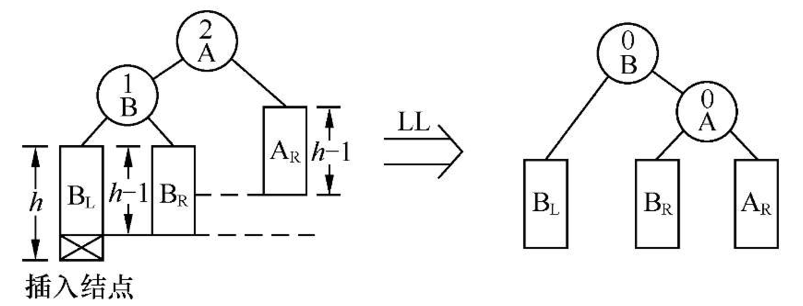

（2）RR型：由于在A的右子树根结点的右子树上插入结点，A的平衡因子由−1变为−2，致使以A为根结点的子树失去平衡，则需进行一次向左的逆时针旋转操作。

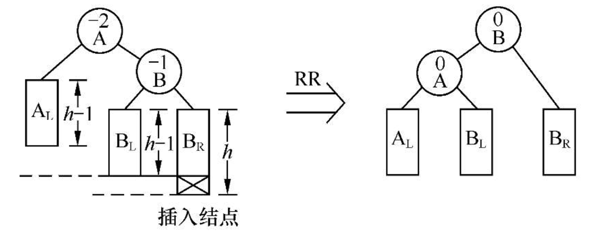

（3）LR型：由于在A的左子树根结点的右子树上插入结点，A的平衡因子由1增至2，致使以A为根结点的子树失去平衡，则需进行两次旋转操作。第一次对B及其右子树进行逆时针旋转，C转上去成为B的根，这时变成了LL型，所以第二次进行LL型的顺时针旋转即可恢复平衡。

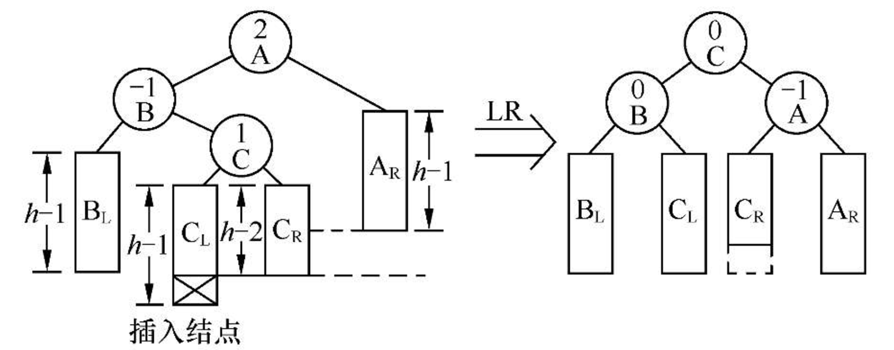

（4）RL型：由于在A的右子树根结点的左子树上插入结点，A的平衡因子由−1变为−2，致使以A为根结点的子树失去平衡，则旋转方法和LR型相对称，也需进行两次旋转，先顺时针右旋，再逆时针左旋。

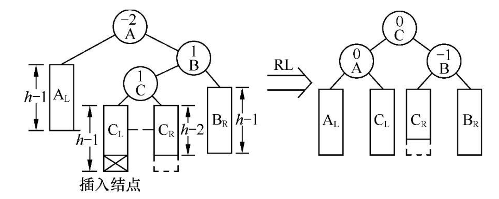

#### 平衡二叉树的查找分析

深度为h的平衡二叉树含有的最少结点数为：
$$
\begin{aligned}
    &N_h = N_{h-1} + N_{h-2} + 1, \quad h \geq 2, \\[8pt]
    &N_0 = 0, \quad N_1 = 1, \quad N_2 = 2. \\[12pt]
\end{aligned}
$$
这个关系与斐波那契数列非常相似：
$$
\begin{aligned}
    &F_0 = 0, \quad F_1 = 1, \quad F_2 = 1, \quad F_3 = 2, \quad F_4 = 3, \quad F_5 = 5, \\[8pt]
    &N_0 = 0, \quad N_1 = 1, \quad N_2 = 2, \quad N_3 = 4, \quad N_4 = 7, \quad N_5 = 12. \\[12pt]
    &\text{When } h \geq 0, \quad N_h = F_{h+2} - 1. \\[8pt]
    &F_h \approx \frac{\varphi^h}{\sqrt{5}}, \quad \varphi = \frac{1 + \sqrt{5}}{2}.
\end{aligned}
$$
可得，有n个结点的平衡二叉树的最大深度为：
$$
h = \log_{\varphi}{(\sqrt{5}(n+1))}-2
$$
因此，平衡二叉树上进行查找的时间复杂度为O(logn)。


### B-树


#### B-树的定义

一棵m阶的B-树，或为空树，或为满足下列特性的m叉树：

（1）树中每个结点至多有m棵子树；

（2）若根结点不是叶子结点，则至少有两棵子树；

（3）除根之外的所有非终端结点至少有$\lceil m/2 \rceil$棵子树；

（4）所有的叶子结点都出现在同一层次上，并且不带信息，通常称为失败结点（失败结点并不存在，指向这些结点的指针为空。引入失败结点是为了便于分析B-树的查找性能）；

（5）所有的非终端结点最多有m−1个关键字。

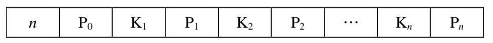

> 其中，Ki（i=1, …, n）为关键字，且Ki<Ki+1（i=1, …, n−1）；Pi（i=0, …,n）为指向子树根结点的指针，且指针Pi−1所指子树中所有结点的关键字均小于Ki（i=1, …, n），Pn所指子树中所有结点的关键字均大于Kn。
>
> 关键字个数取值范围：$\lceil m/2 \rceil - 1 \le n \le m -1$。

B-树具有平衡、有序、多路的特点：

1. 所有叶子结点均在同一层次，这体现出其平衡的特点。

2. 树中每个结点中的关键字都是有序的，且关键字Ki“左子树”中的关键字均小于Ki，而其“右子树”中的关键字均大于Ki，这体现出其有序的特点。

3. 除叶子结点外，有的结点中有一个关键字，两棵子树，有的结点中有两个关键字，三棵子树，这种4阶的B-树最多有三个关键字，四棵子树，这体现出其多路的特点。

#### B-树的查找


## 散列表的查找


### 散列表的基本概念

如果能在元素的存储位置和其关键字之间建立某种直接关系，那么在进行查找时，就无需做比较或做很少次的比较，按照这种关系直接由关键字找到相应的记录。这就是**散列查找法**（Hash Search）的思想，它通过对元素的关键字值进行某种运算，直接求出元素的地址，即使用关键字到地址的直接转换方法，而不需要反复比较。因此，**散列查找法**又叫**杂凑法**或**散列法**。

**散列函数和散列地址**：在记录的存储位置`p`和其关键字`key`之间建立一个确定的对应关系`H`，使`p=H(key)`，称这个对应关系`H`为散列函数，`p`为散列地址。

**散列表**：一个有限连续的地址空间，用以存储按散列函数计算得到相应散列地址的数据记录。通常散列表的存储空间是一个一维数组，散列地址是数组的下标。

**冲突和同义词**：对不同的关键字可能得到同一散列地址，即`key1≠key2`，而`H(key1)=H(key2)`，这种现象称为冲突。具有相同函数值的关键字对该散列函数来说称作同义词，key1与key2互称为同义词。

### 散列函数的构造方法

1．**直接定址法**

取关键字或关键字的某个线性函数值为散列地址，即`H(key)=key`或`H(key)=a *key + b`，其中a和b为常数（这种散列函数叫做自身函数）。

直接定址法所得地址集合和关键字集合的大小相同。因此，对于不同关键字不会发生冲突，但实际中能使用这种哈希函数的情况很少。

2．**数字分析法**

如果事先知道关键字集合，且每个关键字的位数比散列表的地址码位数多，每个关键字由n位数组成，如k1，k2，…，kn，则可以从关键字中提取数字分布比较均匀的若干位作为散列地址。

数字分析法的适用情况：事先必须明确知道所有的关键字每一位上各种数字的分布情况。

3．**平方取中法**

通常在选定散列函数时不一定能知道关键字的全部情况，取其中哪几位也不一定合适，而一个数平方后的中间几位数和数的每一位都相关，如果取关键字平方后的中间几位或其组合作为散列地址，则使随机分布的关键字得到的散列地址也是随机的，具体所取的位数由表长决定。平方取中法是一种较常用的构造散列函数的方法。

4．**折叠法**

将关键字分割成位数相同的几部分（最后一部分的位数可以不同），然后取这几部分的叠加和（舍去进位）作为散列地址，这种方法称为折叠法。根据数位叠加的方式，可以把折叠法分为**移位叠加**和**边界叠加**两种。移位叠加是将分割后每一部分的最低位对齐，然后相加；边界叠加是将两个相邻的部分沿边界来回折叠，然后对齐相加。

折叠法的适用情况：适合于散列地址的位数较少，而关键字的位数较多，且难于直接从关键字中找到取值较分散的几位。

5．**除留余数法**

假设散列表表长为m，选择一个不大于m的数p，用p去除关键字，除后所得余数为散列地址，即`H(key)=key%p`这个方法的关键是选取适当的p，一般情况下，可以选p为小于表长的最大质数。


### 处理冲突的方法

处理冲突的方法与散列表本身的组织形式有关。按组织形式的不同，通常分两大类：**开放地址法**和**链地址法**。

1．**开放地址法**

开放地址法的基本思想是：把记录都存储在散列表数组中，当某一记录关键字key的初始散列地址H0=H(key)发生冲突时，以H0为基础，采取合适方法计算得到另一个地址H1，如果H1仍然发生冲突，以H1为基础再求下一个地址H2，若H2仍然冲突，再求得H3。依次类推，直至Hk不发生冲突为止，则Hk为该记录在表中的散列地址。

这种方法在寻找“下一个”空的散列地址时，原来的数组空间对所有的元素都是开放的，所以称为开放地址法。通常把寻找“下一个”空位的过程称为探测，上述方法可用如下公式表示：
$$
H_i = (H(key) + d_i) \% m \ \ \ i = 1,2,\dots,k\ \ (k \le m-1)
$$
其中，H(key)为散列函数，m为散列表表长，di为增量序列。根据di取值的不同，可以分为以下3种探测方法:

（1）**线性探测法**
$$
d_i = 1,2,\dots,m-1
$$
这种探测方法可以将散列表假想成一个**循环表**，发生冲突时，从冲突地址的下一单元顺序寻找空单元，如果到最后一个位置也没找到空单元，则回到表头开始继续查找，直到找到一个空位，就把此元素放入此空位中。如果找不到空位，则说明散列表已满，需要进行溢出处理。

（2）**二次探测法**
$$
d_i = 1^2, -1^2, 2^2, -2^2, \dots, k^2, -k^2 \ \ (k \le m/2)
$$
（3）**伪随机探测法**
$$
d_i = 伪随机数序列
$$
**线性探测法的优点**：只要散列表未填满，总能找到一个不发生冲突的地址。

**线性探测法的缺点**：会产生“二次聚集”现象。

**二次探测法和伪随机探测法的优点**：可以避免“二次聚集”现象。

**二次探测法和伪随机探测法的缺点**：不能保证一定找到不发生冲突的地址。

> “二次聚集”（或称作“堆积”）：在线性探测法处理冲突的过程中，两个初始散列地址不同的记录争夺同一个后继散列地址的现象，即在处理同义词的冲突过程中又添加了非同义词的冲突。

2．**链地址法**

链地址法的基本思想是：把具有相同散列地址的记录放在同一个单链表中，称为同义词链表。有m个散列地址就有m个单链表，同时用数组HT[0…m−1]存放各个链表的头指针，凡是散列地址为i的记录都以结点方式插入到以HT[i]为头结点的单链表中。

### 散列表的查找


**散列表的存储表示**

```c++
//- - - - -开放地址法散列表的存储表示- - - - -
#define m 20                                            //散列表的表长
typedef struct{
    KeyType key;                                        //关键字项
    InfoType otherinfo;                                 //其他数据项
}HashTable[m];
```

【算法步骤】

① 给定待查找的关键字key，根据造表时设定的散列函数计算H0=H(key)。

② 若单元H0为空，则所查元素不存在。

③ 若单元H0中元素的关键字为key，则查找成功。

④ 否则重复下述解决冲突的过程：

- 按处理冲突的方法，计算下一个散列地址Hi；
- 若单元Hi为空，则所查元素不存在；
- 若单元Hi中元素的关键字为key，则查找成功。

【算法描述】

```c++
#define NULLKEY 0                               //单元为空的标记
int SearchHash(HashTable HT,KeyType key)
{//在散列表HT中查找关键字为key的元素，若查找成功，返回散列表的单元标号，否则返回-1  
   H0=H(key);                                  //根据散列函数H（key）计算散列地址 
   if(HT[H0].key==NULLKEY) return -1;          //若单元H0为空，则所查元素不存在 
   else if(HT[H0].key==key) return H0;         //若单元H0中元素的关键字为key，则查找成功 
   else 
   { 
      for(i=1;i<m;++i) 
     {     
         Hi=(H0+i)%m;                          //按照线性探测法计算下一个散列地址Hi 
         if(HT[Hi].key==NULLKEY) return -1;    //若单元Hi为空，则所查元素不存在 
         else if(HT[Hi].key==key) return Hi;   //若单元Hi中元素的关键字为key，则查找成功 
      }                                        //for 
      return -1; 
    }                                          //else 
}
```

【算法分析】

> 虽然散列表在关键字与记录的存储位置之间建立了直接映像，但由于“冲突”的产生，使得散列表的查找过程仍然是一个给定值和关键字进行比较的过程。因此，仍需以平均查找长度作为衡量散列表查找效率的量度。

查找过程中需和给定值进行比较的关键字的个数取决于三个因素：**散列函数**、**处理冲突的方法**和**装填因子**。

散列表的**装填因子α**定义为:
$$
\alpha = \frac{表中填入的记录数}{散列表的长度}
$$
α标志散列表的装满程度。直观地看，**α越小，发生冲突的可能性就越小**；反之，α越大，表中已填入的记录越多，再填记录时，发生冲突的可能性就越大，则查找时，给定值需与之进行比较的关键字的个数也就越多。

散列函数的“好坏”首先影响出现冲突的频繁程度。但一般情况下认为：凡是“均匀的”散列函数，对同一组随机的关键字，产生冲突的可能性相同，假如所设定的散列函数是“均匀”的，则影响平均查找长度的因素只有两个——处理冲突的方法和装填因子α。

下表给出了在等概率情况下，采用几种不同方法处理冲突时，得到的散列表查找成功和查找失败时的平均查找长度

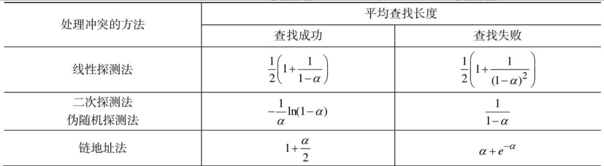


在查找概率相等的前提下，直接计算查找成功的平均查找长度公式为：
$$
ASL_{succ} = \frac{1}{n} \sum_{i=1}^{n}C_i
$$
其中，n为散列表中记录的个数，Ci为成功查找第i个记录所需的比较次数。


在查找概率相等的前提下，直接计算查找失败的平均查找长度公式：
$$
ASL_{unsucc} = \frac{1}{r} \sum_{i=1}^{r}C_i
$$
其中，r为散列函数取值的个数，Ci为散列函数取值为i时查找失败的比较次数。

> 查找失败时有两种情况：
>
> - 单元为空；
> - 按处理冲突的方法探测一遍后仍未找到。假设散列函数的取值个数为r，则0到r−1相当于r个查找失败的入口，从每个入口进入后，直到确定查找失败为止(单元为空)，其关键字的比较次数就是与该入口对应的查找失败的查找长度。


## 小结

线性表的查找：顺序查找、折半查找和分块查找

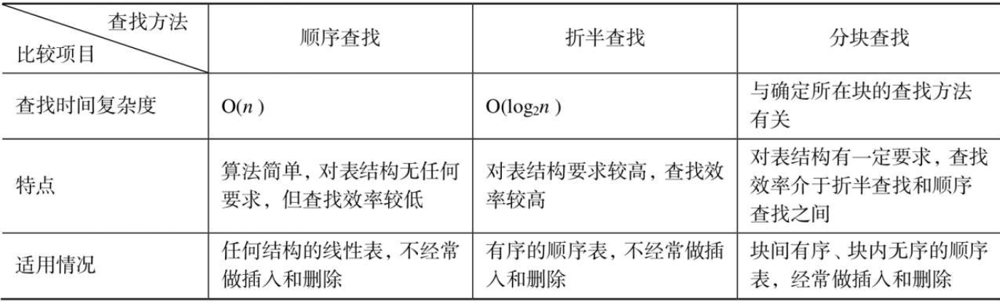

树表的查找：树表的结构主要包括二叉排序树、平衡二叉树、B-树和B+树。

（1）二叉排序树的查找过程与折半查找过程类似

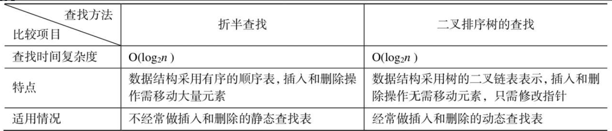

（2）二叉排序树在形态均匀时性能最好，而形态为单支树时其查找性能则退化为与顺序查找相同，因此，二叉排序树最好是一棵平衡二叉树。平衡二叉树的平衡调整方法就是确保二叉排序树在任何情况下的深度均为O(log2n )，平衡调整方法分为4种：LL型、RR型、LR型和RL型。

（3） B-树是一种平衡的多叉查找树，是一种在外存文件系统中常用的动态索引技术。在B-树上进行查找的过程和二叉排序树类似，是一个顺指针查找结点和在结点内的关键字中查找交叉进行的过程。为了确保B-树的定义，在B-树中插入一个关键字，可能产生结点的“分裂”，而删除一个关键字，可能产生结点的“合并”。

（4）B+树是一种B-树的变型树，更适合做文件系统的索引。在B+树上进行随机查找、插入和删除的过程基本上与B-树类似，但具体实现细节又有所区别。


散列表的查找。散列表也属线性结构，但它和线性表的查找有着本质的区别。它不是以关键字比较为基础进行查找的，而是通过一种散列函数把记录的关键字和它在表中的位置建立起对应关系，并在存储记录发生冲突时采用专门的处理冲突的方法。这种方式构造的散列表，不仅平均查找长度和记录总数无关，而且可以通过调节装填因子，把平均查找长度控制在所需的范围内。

散列查找法主要研究两方面的问题：如何构造散列函数，以及如何处理冲突。

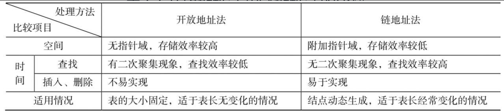


# 排序


## 基本概念和排序方法概述


## 插入排序


### 直接插入排序


## 交换排序

交换排序的基本思想是：两两比较待排序记录的关键字，一旦发现两个记录不满足次序要求时则进行交换，直到整个序列全部满足要求为止。

### 冒泡排序

**冒泡排序**（Bubble Sort）是一种最简单的交换排序方法，它通过两两比较相邻记录的关键字，如果发生逆序，则进行交换，从而使关键字小的记录如气泡一般逐渐往上“漂浮”（左移），或者使关键字大的记录如石块一样逐渐向下“坠落”（右移）。

【算法描述】

```c++
void BubbleSort(SqList &L)
{//对顺序表L做冒泡排序 
   m=L.length-1;flag=1;                           //flag用来标记某一趟排序是否发生交换 
   while((m>0)&&(flag==1)) 
   { 
      flag=0;                                     //flag置为0，如果本趟排序没有发生交换，则不会执行下一趟排序 
      for(j=1;j<=m;j++) 
         if(L.r[j].key > L.r[j+1].key) 
         { 
            flag=1;                                //flag置为1，表示本趟排序发生了交换 
            t=L.r[j]; L.r[j]=L.r[j+1]; L.r[j+1]=t;//交换前后两个记录 
          }                                       //if 
        --m; 
    }                                            //while 
}                                                //BubbleSort
```

【算法分析】

- 时间复杂度

最好情况（初始序列为正序）：只需进行一趟排序，在排序过程中进行n−1次关键字间的比较，且不移动记录。

最坏情况（初始序列为逆序）：需进行n−1趟排序，总的关键字比较次数KCN和记录移动次数RMN（每次交换都要移动3次记录）分别为
$$
KCN =  \sum_{i=n}^{2}{(i-1)} = n(n-1)/2 \\ 
RCN = 3\sum_{i=n}^{2}{(i-1)} = 3n(n-1)/2
$$
在平均情况下，时间复杂度为O(n^2)。

- 空间复杂度

冒泡排序只有在两个记录交换位置时需要一个辅助空间用做暂存记录，所以空间复杂度为O(1)。

### 快速排序

快速排序（Quick Sort）是由冒泡排序改进而得的；快速排序的一次交换可能消除多个逆序。

> 在冒泡排序过程中，只对相邻的两个记录进行比较，因此每次交换两个相邻记录时只能消除一个逆序。如果能通过两个（不相邻）记录的一次交换，消除多个逆序，则会大大加快排序的速度。

【算法步骤】

在待排序的n个记录中任取一个记录（通常取第一个记录）作为**枢轴**（或支点），设其关键字为`pivotkey`。经过一趟排序后，把所有关键字小于`pivotkey`的记录交换到前面，把所有关键字大于`pivotkey`的记录交换到后面，结果将待排序记录分成两个子表，最后将枢轴放置在分界处的位置。然后，分别对左、右子表重复上述过程，直至每一子表只有一个记录时，排序完成。

> 详细步骤：
>
> ① 选择待排序表中的第一个记录作为枢轴，将枢轴记录暂存在r[0]的位置上。附设两个指针low和high，初始时分别指向表的下界和上界（第一趟时，low=1; high=L.length;）。
>
> ② 从表的最右侧位置依次向左搜索，找到第一个关键字小于枢轴关键字pivotkey的记录，将其移到low处。具体操作是：当low<high时，若high所指记录的关键字大于等于pivotkey，则向左移动指针high（执行操作--high）；否则将high所指记录与枢轴记录交换。
>
> ③ 然后再从表的最左侧位置，依次向右搜索找到第一个关键字大于pivotkey的记录和枢轴记录交换。具体操作是：当low<high时，若low所指记录的关键字小于等于pivotkey，则向右移动指针low（执行操作++low）；否则将low所指记录与枢轴记录交换。
>
> ④ 重复步骤②和③，直至low与high相等为止。此时low或high的位置即为枢轴在此趟排序中的最终位置，原表被分成两个子表。
>
> 在上述过程中，记录的交换都是与枢轴之间发生，每次交换都要移动3次记录，可以先将枢轴记录暂存在r[0]的位置上，排序过程中只移动要与枢轴交换的记录，即只做r[low]或r[high]的单向移动，直至一趟排序结束后再将枢轴记录移至正确位置上。

【算法描述】

```c++
int Partition(SqList &L, int low, int high)
{//对顺序表L中的子表r[low..high]进行一趟排序，返回枢轴位置 
   L.r[0]=L.r[low];                     //用子表的第一个记录做枢轴记录 
   pivotkey=L.r[low].key;               //枢轴记录关键字保存在pivotkey中 
   while(low<high)                      //从表的两端交替地向中间扫描 
   {      
      while(low < high && L.r[high].key >= pivotkey) --high; 
      L.r[low]=L.r[high];               //将比枢轴记录小的记录移到低端 
      while(low < high&&L.r[low].key <= pivotkey) ++low; 
      L.r[high]=L.r[low];               //将比枢轴记录大的记录移到高端 
   }                                    //while 
   L.r[low]=L.r[0];                     //枢轴记录到位 
   return low;                          //返回枢轴位置 
}          

void QSort(SqList &L,int low,int high) 
{//调用前置初值：low=1; high=L.length; 
 //对顺序表L中的子序列L.r[low..high]做快速排序 
   if(low<high){                        //长度大于1 
      pivotloc=Partition(L, low, high); //将L.r[low..high]一分为二，pivotloc是枢轴位置 
      QSort(L, low, pivotloc-1);        //对左子表递归排序 
      QSort(L, pivotloc+1, high);       //对右子表递归排序 
   } 
}  
@@@@
void QuickSort(SqList &L) 
{//对顺序表L做快速排序 
   QSort(L,1,L.length); 
}
```

【算法分析】

- 时间复杂度

从快速排序算法的递归树可知，快速排序的趟数取决于递归树的深度。

最坏情况：在待排序序列已经排好序的情况下，其递归树成为单支树，每次划分只得到一个比上一次少一个记录的子序列。这样，必须经过n−1趟才能将所有记录定位，而且第i趟需要经过n−i次比较。这种情况下，快速排序的速度已经退化到简单排序的水平。
$$
KCN =  \sum_{i=1}^{n-1}{(n-i} = n(n-1)/2
$$


平均情况下，快速排序的时间复杂度为O(nlog2n)。

- 空间复杂度

快速排序是递归的，执行时需要有一个栈来存放相应的数据。最大递归调用次数与递归树的深度一致，所以最好情况下的空间复杂度为O(log2n)，最坏情况下为O(n)。

【算法特点】

（1）记录非顺次的移动导致排序方法是不稳定的。

（2）排序过程中需要定位表的下界和上界，所以适合用于顺序结构，很难用于链式结构。

（3）当n较大时，在平均情况下快速排序是所有内部排序方法中速度最快的一种，所以其适合初始记录无序、n较大时的情况。


## 选择排序

### 堆排序

**堆排序**（Heap Sort）是一种树形选择排序，在排序过程中，将待排序的记录r[1..n]看成是一棵完全二叉树的顺序存储结构，利用完全二叉树中双亲结点和孩子结点之间的内在关系，在当前无序的序列中选择关键字最大（或最小）的记录。

n个元素的序列{k1,k2,…,kn}称之为堆，当且仅当满足以下条件时：
$$
k_i \ge k_{2i} \ \ And \ \ K_i \ge K_{2i+1} \\
Or \\
k_i \le k_{2i} \ \ And \ \ K_i \le K_{2i+1} \\
1 \le i \le \lfloor n/2 \rfloor
$$
若将和此序列对应的一维数组（即以一维数组做此序列的存储结构）看成是一个完全二叉树，则堆实质上是满足如下性质的完全二叉树：树中所有非终端结点的值均不大于（或不小于）其左、右孩子结点的值。

​                                                                                                                                                                                                                                                                                                                                                                                                                                                                                                                                                                                                                                                                                                                                                                                                                                                                                                                                                                                                                                                                                                                                                                                                                                                                                                                                                                                                                                                                                                                                                                                                                                                                                                                                                                                                                                                                                                                                                                                                                                                                                                                                                                                                                                                                                                                                                                                                                                                                                                                                                                                                                                                                                                                                                                                                 


## 归并排序


```c++
void Merge(RedType R[],RedType T[],int low,int mid,int high)
{//将有序表R[low..mid]和R[mid+1..high]归并为有序表T[low..high]
   i=low;j=mid+1;k=low;
   while(i<=mid&&j<=high)                 //将R中记录由小到大地并入T中
   {
     if(R[i].key<=R[j].key) T[k++]=R[i++];
     else T[k++]=R[j++];
   }                                      //while
   while(i<=mid) T[k++]=R[i++];           //将剩余的R[i..mid]复制到T中
   while(j<=high) T[k++]=R[j++];          //将剩余的R[j.high]复制到T中
}

void MSort(RedType R[],RedType &T[],int low,int high)
{//R[low..high]归并排序后放入T[low..high]中  
   if(low==high) T[low]=R[low];  
   else 
   {  
      mid=(low+high)/2;       //将当前序列一分为二，求出分裂点mid  
      MSort(R,S,low,mid);     //对子序列R[low..mid]递归归并排序，结果放入S[low..mid]  
      MSort(R,S,mid+1,high);  //对子序列R[mid+1..high]递归归并排序，结果放入S[mid+1..high] 
      Merge(S,T,low,mid,high);//将S[low..mid]和S[mid+1..high]归并到T[low..high] 
   }         //else  
}  

void MergeSort(SqList &L) 
{//对顺序表L做归并排序  
   MSort(L.r, L.r, 1, L.length);  
}
```


## 基数排序


## 外部排序


## 小结

内部排序是外部排序的基础，必须通过内部排序产生初始归并段之后，才能进行外部排序。

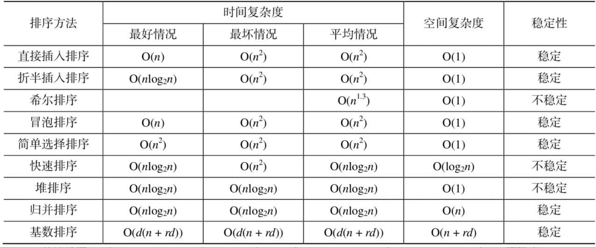

【结论1】

当待排序的记录个数n较小时，n^2和nlog n的差别不大，可选用简单的排序方法。而当关键字基本有序时，可选用直接插入排序或冒泡排序，排序速度很快，其中直接插入排序最为简单常用、性能最佳。

【结论2】

当n较大时，应该选用先进的排序方法。对于先进的排序方法，从平均时间性能而言，快速排序最佳，是目前基于比较的排序方法中最好的方法。但在最坏情况下，即当关键字基本有序时，快速排序的递归深度为n，时间复杂度为O($n^2$)，空间复杂度为O(n)。堆排序和归并排序不会出现快速排序的最坏情况，但归并排序的辅助空间较大。这样，当n较大时，具体选用的原则是：

① 当关键字分布随机，稳定性不做要求时，可采用快速排序；

② 当关键字基本有序，稳定性不做要求时，可采用堆排序；

③ 当关键字基本有序，内存允许且要求排序稳定时，可采用归并排序。

【结论3】

可以将简单的排序方法和先进的排序方法结合使用。

> 例如，当n较大时，可以先将待排序序列划分成若干子序列，分别进行直接插入排序，然后再利用归并排序，将有序子序列合并成一个完整的有序序列。或者，在快速排序中，当划分子区间的长度小于某值时，可以转而调用直接插入排序算法。

【结论4】

基数排序的时间复杂度也可写成O(d·n)。因此，它最适用于n值很大而关键字较小的序列。若关键字也很大，而序列中大多数记录的“最高位关键字”均不同，则亦可先按“最高位关键字”不同将序列分成若干“小”的子序列，而后进行直接插入排序。但基数排序使用条件有严格的要求：需要知道各级关键字的主次关系和各级关键字的取值范围，即只适用于像整数和字符这类有明显结构特征的关键字，当关键字的取值范围为无穷集合时，则无法使用基数排序。

【结论5】

从方法的稳定性来比较，基数排序是稳定的内排方法，所有时间复杂度为O($n^2$)的简单排序法也是稳定的，然而，快速排序、堆排序和希尔排序等时间性能较好的排序方法都是不稳定的。

> 当需要按次关键字进行排序时，要保持主关键字排序的结果不变。
>

【结论6】

在本文讨论的排序方法中，多数是采用顺序表实现的。若记录本身信息量较大，为避免移动记录耗费大量时间，可采用链式存储结构。比如直接插入排序、归并排序都易于在链表上实现。但像折半插入排序、希尔排序、快速排序和堆排序，却难于在链表上实现。
