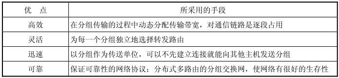

```
书名：计算机网络（第6版）
作者：谢希仁
出版社：电子工业出版社
出版时间：2013-06
ISBN：9787121201677
```

# 概述

计算机网络向用户提供的最重要的功能：

(1) 连通性：计算机网络使上网用户之间都可以交换信息。

(2) 共享：指资源共享。资源共享的含义是多方面的，可以是信息共享、软件共享，也可以是硬件共享。


## 因特网概述


### 网络的网络

**网络(network)**：由若干结点(node)和连接这些结点的链路(link)组成。网络中的结点可以是计算机、集线器、交换机或路由器等。

**internet（互联网或互连网）**：指网络和网络还可以通过路由器互连起来，这样构成的一个覆盖范围更大的网络。因此互联网是“网络的网络”(network of networks)。

**Internet（因特网）**：起源于美国的因特网现已发展成为世界上最大的国际性计算机互联网，是世界上最大的互连网络，它采用TCP/IP协议族作为通信的规则，且其前身是美国的ARPANET。

**主机(host)**：指连接在因特网上的计算机。


网络把许多计算机连接在一起，而因特网则把许多网络连接在一起。并且，网络互联并不是把计算机仅仅简单地在物理上连接起来，还必须在计算机上安装许多使计算机能够交换信息的软件才行。


### 因特网发展的三个阶段

因特网的基础结构大体上经历了三个阶段的演进。

> 这三个阶段在时间划分上并非截然分开而是有部分重叠的，这是因为网络的演进是逐渐的而不是在某个日期突然发生了变化。

**第一阶段从单个网络ARPANET向互联网发展的过程。**

1969年美国国防部创建的第一个分组交换网ARPANET最初只是一个单个的分组交换网（并不是一个互连的网络）。

1983年，TCP/IP协议成为ARPANET上的标准协议，使得所有使用TCP/IP协议的计算机都能利用互连网相互通信，因而人们就把1983年作为因特网的诞生时间。


**第二阶段的特点是建成了三级结构的因特网。**

从1985年起，美国国家科学基金会NSF就围绕六个大型计算机中心建设计算机网络，即国家科学基金网NSFNET。它是一个三级计算机网络，分为**主干网**、**地区网**和**校园网（或企业网）**。


**第三阶段的特点是逐渐形成了多层次 ISP 结构的因特网。**

从1993年开始，由美国政府资助的NSFNET逐渐被若干个商用的因特网主干网替代，而政府机构不再负责因特网的运营。

因特网服务提供者ISP (Internet Service Provider)，即商用的因特网主干网提供者。

根据提供服务的覆盖面积大小以及所拥有的IP地址数目的不同，ISP也分成为不同的层次：主干ISP、地区ISP和本地ISP。

因特网交换点 IXP (Internet eXchange Point)：允许两个网络直接相连并交换分组，而不需要再通过第三个网络来转发分组。IXP常采用工作在数据链路层的网络交换机，这些网络交换机都用局域网互连起来。


因特网的迅猛发展始于20世纪90年代，由欧洲原子核研究组织CERN开发的万维网WWW(World Wide Web)被广泛使用在因特网上，大大方便了广大非网络专业人员对网络的使用，成为因特网的这种指数级增长的主要驱动力。万维网的站点数目也急剧增长。


### 因特网的标准化工作

1992年由于因特网不再归美国政府管辖，因此成立了一个国际性组织叫做**因特网协会**(Internet Society，简称为ISOC)[W-ISOC]，以便对因特网进行全面管理以及在世界范围内促进其发展和使用。ISOC下面有一个技术组织叫做**因特网体系结构委员会**IAB (Internet Architecture Board)，负责管理因特网有关协议的开发。

IAB下面又设有两个工程部：

(1) 因特网工程部IETF (Internet Engineering Task Force)

(2) 因特网研究部IRTF (Internet Research Task Force)


所有的因特网标准都是以RFC的形式在因特网上发表的。RFC (Request For Comments)的意思就是“请求评论”。


制定因特网的正式标准要经过以下的四个阶段[RFC 2026]：

(1) 因特网草案(Internet Draft) ——在这个阶段还不是RFC文档。

(2) 建议标准(Proposed Standard) ——从这个阶段开始就成为RFC文档。

(3) 草案标准(Draft Standard)。

(4) 因特网标准(Internet Standard)。


## 因特网的组成

因特网从其工作方式上看，可以划分为以下的两大块：

(1) 边缘部分 由所有连接在因特网上的主机组成。这部分是用户直接使用的，用来进行通信（传送数据、音频或视频）和资源共享。

(2) 核心部分 由大量网络和连接这些网络的路由器组成。这部分是为边缘部分提供服务的（提供连通性和交换）。


### 因特网的边缘部分

端系统(end system)：处在因特网边缘的部分就是连接在因特网上的所有的主机。

“主机A和主机B进行通信”，实际上是指：“运行在主机A上的某个程序和运行在主机B上的另一个程序进行通信”。由于“进程”就是“运行着的程序”，因此这也就是指：“主机A的某个进程和主机B上的另一个进程进行通信”。这种比较严密的说法通常可以简称为“计算机之间通信”。

在网络边缘的端系统之间的通信方式通常可划分为两大类：客户-服务器方式（C/S方式）和对等方式（P2P方式）。

1.客户-服务器方式

客户(client)和服务器(server)都是指通信中所涉及的两个应用进程。客户是服务请求方，服务器是服务提供方。服务请求方和服务提供方都要使用网络核心部分所提供的服务。

2.对等连接方式

对等连接(peer-to-peer，简写为P2P)是指两个主机在通信时并不区分哪一个是服务请求方还是服务提供方。只要两个主机都运行了对等连接软件（P2P软件），它们就可以进行平等的、对等连接通信。


### 因特网的核心部分

在网络核心部分起特殊作用的是路由器（router），它是一种专用计算机（但不是主机）。路由器是实现分组交换（packet switching）的关键构件，其任务是转发收到的分组，这是网络核心部分最重要的功能。

- 电路交换
- 分组交换


**交换（switching）**：从通信资源的分配角度来看，交换就是按照某种方式动态地分配传输线路的资源。

**电路交换**：这种必须经过“**建立连接**（占用通信资源）→**通话**（一直占用通信资源）→**释放连接**（归还通信资源）”三个步骤的交换方式。电路交换的一个**重要特点**就是在通话的全部时间内，通话的两个用户始终占用端到端的通信资源。

当使用电路交换来传送计算机数据时，其线路的传输效率往往很低。


**报文**：要发送的整块数据称为一个报文。

**分组交换则采用存储转发技术**：在发送报文之前，先把较长的报文划分成为一个个更小的等长数据段，在每一个数据段前面，加上一些必要的控制信息组成的**首部**(header)后，就构成了一个**分组**(packet)。分组又称为“**包**”，而分组的首部也可称为“**包头**”。


**分组交换的工作方式**

位于网络边缘的主机和位于网络核心部分的路由器都是计算机，但它们的作用却很不一样。主机是为用户进行信息处理的，并且可以和其他主机通过网络交换信息。路由器则是用来转发分组的，即进行分组交换的。路由器收到一个分组，先暂时存储一下，检查其首部，查找**转发表**，按照首部中的目的地址，找到合适的接口转发出去，把分组交给下一个路由器。这样一步一步地（有时会经过几十个不同的路由器）以存储转发的方式，把分组交付最终的目的主机。

**实现分组交换的重点**

各路由器之间必须经常交换彼此掌握的路由信息，以便创建和维持在路由器中的转发表，使得转发表能够在整个网络拓扑发生变化时及时更新。

当我们讨论因特网的核心部分中的路由器转发分组的过程时，往往把单个的网络简化成一条**链路**，而路由器成为核心部分的**结点**。

**存储转发的分组交换**

分组交换在传送数据之前不必先占用一条端到端的通信资源。分组在哪一段链路上传送时，才占用这段链路的通信资源。分组到达一个路由器后，先暂时存储下来，查找转发表，然后从另一条合适的链路转发出去。分组在传输时就这样一段段地断续占用通信资源，而且还省去了建立连接和释放连接的开销，因而数据的传输效率更高。




**分组交换带来新的问题**

分组在各路由器存储转发时需要排队，这就会造成一定的**时延**。

由于分组交换不像电路交换那样通过建立连接来保证通信时所需的各种资源，因而无法确保通信时端到端所需的**带宽**。

分组交换网带来的另一个问题是各分组必须携带的控制信息也造成了一定的**开销**(overhead)。整个分组交换网还需要专门的管理和控制机制。


三种交换方式在数据传送阶段的主要特点：

电路交换——整个报文的比特流连续地从源点直达终点，好像在一个管道中传送。

报文交换——整个报文先传送到相邻结点，全部存储下来后查找转发表，转发到下一个结点。

分组交换——单个分组（这只是整个报文的一部分）传送到相邻结点，存储下来后查找转发表，转发到下一个结点。